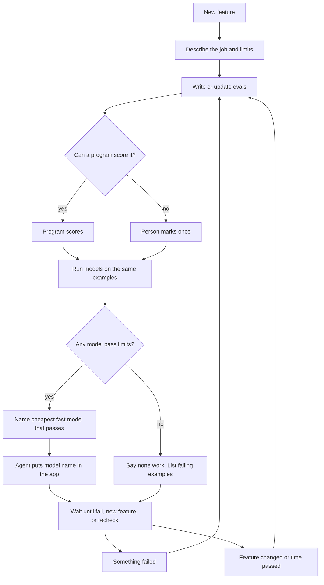

# EvalRouter — product spec (spec-driven)

**Status:** first version (v0)  
**Date:** 25 August 2026  
**Audience:** implementers and coding agents  
**Language:** short sentences. Everyday technical words. One idea per sentence.

If a term is needed, define it the first time. Do not use pin, gold, glue, wedge, bake-off, Pareto, or IAA unless that word is defined in the same paragraph.

This file is the build contract. Build from this file, not from research notes. Slice files under `spec/` are source notes by user. If a slice and this file disagree, this file wins.

---

## How you use this tool

This is an **agent tool** and an **HTTP API**. An agent tool is a JSON function the model invokes. The HTTP API is `POST /v1/tools/{name}`. Same JSON body either way.

You add it. You put it in the agent’s MCP config (MCP is a config file that lists tools the model may call), or you call the API URL with a key. Agents do not find this tool on the internet by themselves.

It is **not** in front of OpenRouter or Ramp. Live users go: app → OpenRouter or Ramp → model. This tool never sits on that path.

How it joins the app: the agent calls this tool, gets a **named model** (the model id to put in the app), and writes that name into the app (`.env` or config). CI can call the same JSON later to recheck. This tool never switches live traffic by itself.

It is not a second OpenRouter. It does not rewrite the prompt. It does not auto-swap the live model.

---

## 1. Words we will use

- **Eval:** a check on one example. Input in. A score says whether the model did the job.
- **Code eval:** a program scores it. Examples: valid JSON, correct tool name, a field equals a known value, a check in the repo, a must-not-contain check. No person is needed on each run.
- **Draft eval:** a suggested check. It is not trusted yet.
- **Draft answer:** a suggested right answer or pass/fail a model wrote. It is not trusted.
- **Marked eval:** a person set the right answer or pass/fail because a program cannot decide (tone, fuzzy “good reply”). Two people must agree, or a third decides. Only then it is trusted for a model choice.
- **Trusted eval:** one we will use to name a model. Code evals become trusted once accepted (or, on a failure, once a program check is supplied). Marked evals become trusted only after the two-person (or third-person) step.
- **Eval set:** a versioned list of evals. New work makes a new version. Old versions stay.
- **Run:** models scored on one eval-set version. It stores quality, time, and cost on the same examples.
- **Named model:** the model the agent should put in the app. We recommend it. We do not apply it to live traffic.
- **Job:** what the feature does, plus limits (images, max wait, max spend, allowed models).
- **Project:** one AI feature.
- **Failure:** a bad example. It is a candidate eval until `register_failure` adds it.
- **Recheck:** run the saved evals again with the same scoring.
- **Cost cap:** max dollars this run may spend on model calls.
- **Partial results:** the evals that finished before the cap (or a stop). Stored under a run id. A partial pass is not a pass.
- **Fail the build:** the CI job exits unsuccessful so merge or deploy stops. This is not a model change.
- **Live traffic:** real user requests in the app. This tool never sends them and never switches the model that serves them.
- **`next_action`:** always present on success and on error. It is the next tool to call, or a request to ask the human, then which tool to call after that.

---

## 2. Product

**Name:** EvalRouter (working name)

**One line:** A tool a coding agent calls to check an AI feature with evals, name the cheapest fast model that still passes, and run that check again when the feature changes.

**Vision:** Check that this AI feature works. Then pick the best model that makes it work.

Works means: it passes evals for this job, including hard examples, at a speed and price you accept.

Best means: among models that pass, the cheapest and fastest. Not the model that wins public rankings.

OpenRouter sends prompts to a model. This tool answers two questions: does this feature work, and which model makes it work.

Live user traffic never goes through this tool.

### Users

- **Coding agent** (Cursor, Claude Code, Codex, or a custom agent): calls the tools. Finishes the loop without a dashboard. Writes the named model into app config. Does not mark. Does not invent trusted answers.
- **Developer:** owns the AI feature. Accepts or edits draft evals. Marks only when a program cannot score. Approves or rejects the named model. Puts the approved name in the app, or lets the agent write it after approval.
- **Second person:** a domain person or teammate. Marks the same evals when a program cannot score. A third person decides if the first two disagree. Does not name a model.
- **CI or timer:** re-runs frozen evals. Fails the build if the named model now fails. Does not wait for a person. Does not pick a new model. Does not write config. Does not change live traffic.

---

## 3. The loop

Three ways in. Same steps after that.



**Start:** Agent says what the feature does. Tool writes evals. Score with a program if you can. People mark only the rest. Run models. Name a model or say none work. Agent puts the name in the app.

**Fail:** A bad example comes in. It becomes an eval. Keep old evals. Score, run, name again.

**Change:** New feature or real use changed. Add evals for the new work. Keep old evals. Score, run, name again.

---

## 4. Goals

1. Check the feature works on evals for this job.
2. Name the cheapest fast model that still passes, under time and money limits.
3. Repeat when the feature changes, a failure appears, or real use changes.
4. Prefer a program to score. People mark only when a program cannot. Mark once.

### Not in first version

- Send live user requests through this tool
- Change the live model by ourselves
- Rewrite the prompt
- Pick a model per live request
- A full eval website (tables, experiments, datasets)
- Crowd marking
- Copy DeepEval’s metric list or dashboard

---

## 5. Objects

| Object | Meaning |
| --- | --- |
| Project | One AI feature |
| Job | What it does + limits (images, max wait, max spend, allowed models) |
| Eval set | Versioned list of evals. New work = new version. Old versions stay |
| Eval | One example + how to score it |
| Code eval | A program scores it |
| Marked eval | A person set the right answer or pass/fail. Two people agree, or a third decides |
| Draft eval | Suggested. Not trusted yet |
| Run | Models × one eval-set version. Stores quality, time, cost |
| Named model | What the agent should put in the app. We recommend. We do not apply it live |
| Failure | A bad example. Becomes a candidate eval |

Ids are opaque strings with a prefix:

| Prefix | Object |
| --- | --- |
| `prj_` | Project |
| `job_` | Job (description + limits) |
| `ste_` | Eval set |
| `cas_` | Eval |
| `run_` | Run |
| `rec_` | Named-model recommendation |
| `pkr_` | Keys reference |

---

## 6. Jobs and done-when

Each job is Given / When / Then. Then is the done check.

### J1 — Start a new AI feature

**Goal:** Describe the job. Get draft evals.

**Given** a job description and optional sample files (and optional limits).

**When** the agent calls `generate_eval_suite`.

**Then** it gets:

- an eval set id
- at least one eval, each tagged `draft`
- which evals a program can score (`code`) vs which need a person (`person`)
- a mark URL only if some evals need a person
- `next_action`

If the job type is known, reuse that type’s score methods and hard examples, and add the sample files.

If the job type is unknown, do not fake a match. Ask what good means (how it should behave, what success is, what must never happen). Write pass/fail checks from that. Do not invent trusted answers.

Prefer code evals. People mark only the rest.

Computer-made drafts stay tagged `draft` until the developer accepts them. Accept is a screen, not a tool.

**Done:** `ste_` exists. At least one eval. Drafts are tagged `draft`.

**Branches:**

- All code evals (after accept) → `next_action.tool = run_evals` (skip mark tools).
- Some person evals → `next_action.tool = queue_for_labeling`, `mark_url` set.
- Cannot write evals yet → error `JOB_UNCLEAR`. Agent asks the human what good means, then calls `generate_eval_suite` again with that text.

### J2 — Score without a person where possible

**Given** an eval with a program check (valid JSON, tool name, known field, a check in the repo, must-not-contain).

**When** it is scored.

**Then** a program scores every run. No mark screen. It never sits in a mark queue.

**Done:** those evals never sit in a mark queue. Code evals never require a person.

### J3 — Mark only when a program cannot score

**Skip.** Given an eval with a program check. When it is scored. Then a program scores every run. The developer and the second person do not see this eval on a mark screen.

**Mark.** Given evals with no program check (tone, fuzzy “good reply”, messy extract with no single right JSON, image or PDF judgment with no known expected fields). When people must decide. Then a mark screen for those evals only. The developer may be first, second, or third. The second person marks the same evals. They do not see each other’s mark before they submit. Order does not matter.

They write the right answer or pass/fail. They may confirm, edit, or reject a draft answer a model suggested. Accepting a draft is their mark, not automatic trust. A model does not create a trusted eval by itself.

Mark once. Later runs use that mark. A program re-runs the scoring. Nobody marks the same example again each run.

Two people mark the same example. If they disagree, a third person who did not mark this eval decides. They see the input, both marks, and any draft. They pick one mark, write a new mark, or drop the eval. Their decision is the trusted mark. The first two do not vote again.

If every eval in the set is a code eval, there is no mark link. The queue is empty.

A failure that a program can score does not go to mark. A failure that needs a person does.

**Too few trusted evals.** Given a mark queue that is unfinished, and not enough trusted evals (about 10 is the start bar; if every remaining eval is a code eval, at least 5 may be enough). When the agent asks for a named model. Then the product returns `need_more_evals` and a mark link. It does not fake a model name. Untrusted evals do not block a name if enough trusted evals already exist.

**Cannot mark.** Given an example a person cannot judge (broken input, missing file, not their domain). When they choose cannot mark. Then they leave a short reason. The eval is not trusted. It does not count toward naming a model until someone who can judge it marks it, or it is dropped.

**Done:**

- Code evals never appear on a mark screen and never sit in a mark queue.
- Fuzzy evals appear only until they are marked and agreed, or a third person decides.
- People mark once per example per eval-set version, not per run.
- An eval is trusted only after two people agree or a third person decides (person path), or after the developer accepts a code eval (code path).
- A model name is not returned unless enough trusted evals exist. If too few, `need_more_evals` and the mark link. Do not fake a model name.

### J4 — Run models and name the cheapest fast model that still passes

**Goal:** Run a short list of models on the same trusted evals. Name the cheapest fast model that still passes, or say none work.

**Given** a trusted eval set and the job’s limits.

**When** the agent calls `run_evals`, polls with `get_eval_report` until the run finishes, then calls `recommend_models` with `intent: "new_feature"` (or `add_feature` / `after_failure` / `recheck` when those paths apply).

**Then** the run records quality, time, and cost for each model on the same evals. `recommend_models` then:

1. Drops models that miss hard limits (cannot see images, too slow, too expensive, not allowed).
2. Drops models that fail the trusted evals.
3. If none remain: `does_not_work` plus failing eval ids. `named_model` is null. Do not name a model that fails.
4. If some remain: name the cheapest fast one that still passes.
5. Name a slower or costlier model only if quality is clearly better and limits still hold.
6. Return 0–2 backup models. Backups must also pass.

If there are too few trusted evals, return `need_more_evals` and the mark URL. Do not fake a named model.

The developer sees the name, 0–2 backups, quality, time, and cost. They approve or reject. Approve means the agent may write that name into the app. Reject means that name is not written by this tool. This tool does not change live traffic either way. The developer does not approve a model that fails trusted evals. The developer does not approve a name when there are too few trusted evals.

**Done:** The agent has a model id to write into the app, or a clear no with failing eval ids. Live traffic was not changed.

**Branches:**

- Named model returned → developer approves → agent writes the id into config. Stops.
- `does_not_work` → show failing eval ids. Do not write a model id.
- `need_more_evals` → `queue_for_labeling` or add examples. Do not name a model.
- `COST_CAP_EXCEEDED` → read the partial `run_id`, raise the cap, or run a smaller model list.

### J5 — A failure becomes an eval

**Given** a bad example and an existing eval set.

**When** the agent, CI, or a hook calls `register_failure`.

**Then** the tool copies every old eval into a **new** eval-set version and adds the example as a new eval. New `ste_` id. New `version` number. The previous `ste_` is unchanged. Old evals stay in both versions. Do not delete old evals. Do not edit the old `ste_` in place.

**How the example is scored:**

A program scores the new eval when at least one of these is true:

1. The caller sent a program check (expected field, valid JSON, right tool name, must-not-contain, a fixture file).
2. The job type already has a program check that fits this input, and no person is required to know the right answer.

Then the new eval is a code eval. It is trusted. `next_action` is `run_evals` on the **new** `ste_`. No mark queue.

A person is needed when a program cannot decide (tone, fuzzy “good reply”, no single right JSON). Then the new eval is a draft. It is not trusted. `next_action` is mark (`queue_for_labeling`). CI cannot mark. CI fails the build with `need_more_evals`. It does not treat the draft as a pass or a fail of the named model.

A model may suggest a check or an expected answer. A program or a person must confirm. A model does not create a trusted eval by itself.

If the same example is registered again with the same `idempotency_key`, return the existing new `ste_` and `cas_`. Do not add a duplicate eval.

**Done:**

- A new `ste_` exists. The new eval is on it. Every old eval is still on it.
- The previous `ste_` still exists.
- Next J4 / `run_evals` on the new version includes the new eval **and** the old ones.
- If the new eval is a code eval, a later recheck of the new version scores it with a program.
- If it needs a person, it stays draft until marked. CI has exited unsuccessful.

### J6 — A new feature does not drop old evals

**Given** an existing named model and new work.

**When** the agent calls `generate_eval_suite` with `intent: "add_feature"` and the existing `eval_set_id`.

**Then** the product writes new draft evals for the new work. Old evals stay. The next model run uses the union: old evals plus new ones. The eval set gets a new version. Old versions stay.

The developer still accepts or edits the new drafts. They still mark only the ones a program cannot score. They cannot drop old evals to make a new model look good. Do not name a model that fails old evals.

You may retire an old example that no longer happens. That is a new eval-set version. History is not deleted. Going backwards on old work is not allowed in v0.

**Done:**

- The union still contains every old trusted eval, unless it was retired in a new version.
- A named model that fails an old eval is not offered for approval.
- Going backwards on old work is not allowed in v0.

### J7 — Check again later on a saved eval-set version

**Given** a saved eval-set version and a named model.

**When** CI or a timer calls `run_evals` with `intent: "recheck"`. The agent may also re-run.

**Then** the tool runs the **same** evals with the **same** scoring. It reports pass/fail, time, and cost for the named model. It does not add evals. It does not drop evals. It does not write a new named model. It does not change live traffic.

Same scoring means: the same program checks, and the same marked answers. Do not invent new expected answers on a recheck.

This run scores trusted evals on the frozen `ste_` only. Draft evals waiting for a person are not scored as pass/fail. If trusted evals are too few to trust a pass, return `need_more_evals` and fail the build. Do not report a pass.

**Fail the build. Do not change live traffic.**

If the named model fails any trusted eval, or misses the job’s time or spend limits, this job fails the build.

Return `need_new_model` when the named model now fails. A later agent may call `recommend_models` with `after_failure`. CI does not.

Return `does_not_work` only if this run also scored the backups on the same `rec_` and those fail too. CI still does not name a model. CI still does not change live traffic. A recheck that scored only the named model uses `need_new_model`, not `does_not_work`.

A green result on the frozen evals is not a pass if the job was also given new bad examples that are not in this eval set. Return `evals_missing_new_failures`. Next action is `register_failure` (J5). Then fail the build.

Recheck never swaps the production model. The app keeps using whatever model is already in its config until a person or an agent changes that config.

CI does not call `recommend_models`. CI does not mark examples. If a person is needed, the output says so and the build fails.

`run_evals` is async. Immediate output includes `run_id` and `status: "queued"` or `"running"`. CI polls `get_eval_report` with that `run_id`. It must not exit 0 while status is `queued` or `running`.

**Cost cap.** If spend reaches `max_eval_spend_usd` before every trusted eval is scored: stop further model calls. Store what finished. Return `COST_CAP_EXCEEDED` and the partial `run_id`. Fail the build. Do not change live traffic. Do not treat a partial pass as a pass.

**Done:**

- The run used the given `ste_` and did not mutate it.
- Scoring matches the saved evals.
- The report includes pass/fail, time, and cost for the named model.
- If the named model now fails: `need_new_model` or `does_not_work`, build unsuccessful, live traffic unchanged.
- If new bad examples were given and are not in the set: `evals_missing_new_failures`. That is not a pass.
- If the cost cap stops the run: partial results stored, build unsuccessful, live traffic unchanged.

### J8 — Short report that fits in context

**Given** a `run_id` (or a `rec_` named-model id).

**When** the agent (or CI) calls `get_eval_report`.

**Then** it gets a short summary: what passed, what failed, time, cost, whether new bad examples are missing from the eval set, and a report URL. Eval rows are paginated. No full traces. No model output blobs.

**Done:** The payload fits in the agent context. A human can open `report_url` for detail.

**Branches:**

- `status` is `queued` or `running` → poll `get_eval_report` again with the same `run_id`.
- `status` is `succeeded` or `partial` → `next_action` is usually `recommend_models` (agent). CI maps the result to a build exit instead.
- New bad examples are not in the eval set → error `evals_missing_new_failures`. Next tool is `register_failure`. That is not a pass.

---

## 7. Agent tools (first version)

Same JSON on the agent tool and on `POST /v1/tools/{name}`. Small output. `additionalProperties` false on inputs. Enums for anything the agent branches on. Always `next_action`.

| Tool | Job | Notes |
| --- | --- | --- |
| `generate_eval_suite` | J1, J6 | Writes draft evals. Known job type: use library. Unknown: ask what good means, write pass/fail checks. Do not invent trusted answers. Do not run models. |
| `queue_for_labeling` | J3 | Only evals a program cannot score. Returns mark URL. Skip if all are code evals. |
| `get_label_status` | J3 | Counts: draft / code / waiting for person / trusted. Does not mark. |
| `run_evals` | J4, J7 | Async. Cost cap. Customer keys. Does not send live user traffic. |
| `recommend_models` | J4 | `intent`: `new_feature` \| `add_feature` \| `after_failure` \| `recheck`. Recommend only. CI does not call this. |
| `register_failure` | J5 | Failure → candidate eval on a new eval-set version. Old evals stay. If it needs a person, `next_action` is mark. If a program can score it, skip mark. |
| `get_eval_report` | J8 | Short. Paginate eval rows. Also used to poll `run_evals`. |

### Shared rules

- `additionalProperties: false` on inputs
- Opaque ids only
- Default short model list size = 5. If `models` is set, 1–8
- Eval rows paginated: default 20, max 50
- Work over 2 seconds is async. Returns `run_id`. Poll `get_eval_report`
- Mutating calls take `idempotency_key`
- Truncate `input` / `output`. No full traces

`next_action` shape:

```jsonc
{
  "tool": "generate_eval_suite" | "queue_for_labeling" | "get_label_status" | "run_evals" | "recommend_models" | "register_failure" | "get_eval_report" | null,
  "args": {},
  "ask_human": null | "what good means" | "open mark_url" | "none of the models passed; see failing_eval_ids"
}
```

If `tool` is null, the agent must do `ask_human`, then call the tool named in a follow-up `next_action` or retry the same tool with the new text.

### Call order (J1 → J4)

Target: finish J1 through J4 in at most seven tool calls.

1. `generate_eval_suite`
2. `queue_for_labeling` only if some evals need a person
3. `get_label_status` until enough trusted evals (or skip if all were code evals)
4. `run_evals` (returns immediately)
5. `get_eval_report` until the run is done (counts as tool calls)
6. `recommend_models`

If `generate_eval_suite` returns `JOB_UNCLEAR`, the extra generate call after the human answers still counts toward the seven.

Developer accept of drafts is a screen. It is not one of the seven tool calls.

### 7.1 `generate_eval_suite`

**Jobs:** J1. Also J6 when the feature grew.

**When to call:** First call for a new feature. Call again after `JOB_UNCLEAR` with what good means. Call again when adding work to an existing eval set (`intent: "add_feature"`).

**Do:** Write draft evals. Known job type: use the library, plus sample files. Unknown job type: write pass/fail checks from what good means. Split code vs person. Tag computer-made examples `draft`. Do not invent trusted answers. Do not run models.

**Input:**

```jsonc
{
  "project_id": "prj_..." | null,          // created if omitted
  "eval_set_id": "ste_..." | null,         // required when intent is add_feature
  "intent": "new_feature" | "add_feature",
  "description": "Invoice image → JSON line items",
  "sample_files": [{ "path": "fixtures/inv-001.json", "content": "..." }],
  "limits": {
    "needs_images": true,
    "modalities": ["text", "image", "audio"],
    "max_wait_ms": 3000,
    "max_spend_usd_per_1k": 12.0,
    "allowed_models": ["anthropic/*", "openai/*"],
    "excluded_models": []
  },
  "what_good_means": null | {
    "how_it_should_behave": "...",
    "success": "...",
    "must_never": "..."
  },
  "size": "smoke" | "standard"             // smoke <= 15 evals, standard <= 60
}
```

Required: `description`, or `what_good_means` after `JOB_UNCLEAR`. `intent` defaults to `new_feature`. `sample_files` optional. `limits` optional. `eval_set_id` required for `add_feature`.

**Output:**

```jsonc
{
  "project_id": "prj_...",
  "job_id": "job_...",
  "eval_set_id": "ste_...",
  "version": 1,
  "evals": [
    { "eval_id": "cas_...", "title": "JSON has line_items[]", "score_how": "code", "status": "draft" }
  ],
  "n_code": 8,
  "n_person": 2,
  "n_draft": 10,
  "counts": { "draft": 10, "code": 8, "needs_person": 2, "trusted": 0, "total": 10 },
  "mark_url": "https://..." | null,
  "next_action": { "tool": "run_evals" | "queue_for_labeling", "args": {}, "ask_human": null }
}
```

Return at most a short preview of evals in `evals` (first 5). Full list is paginated via `get_eval_report`.

**Errors to branch on:**

| code | when | next_action |
| --- | --- | --- |
| `JOB_UNCLEAR` | Cannot write evals from the description | `tool: null`, `ask_human: "what good means"`. Then call this tool again with `what_good_means`. |

### 7.2 `queue_for_labeling`

**Jobs:** J3. The coding agent calls it so a person can mark.

**When to call:** After J1, only for evals a program cannot score. Skip if `n_person = 0`.

**Do:** Put those evals in the mark queue. Return a mark URL. Do not queue code evals.

**Input:**

```jsonc
{
  "project_id": "prj_...",
  "eval_set_id": "ste_...",
  "eval_ids": ["cas_..."] | null   // default: all person evals in the set
}
```

Required: `project_id`, `eval_set_id`.

**Output:**

```jsonc
{
  "n_queued": 2,
  "mark_url": "https://...",
  "next_action": { "tool": "get_label_status", "args": { "eval_set_id": "ste_..." }, "ask_human": "open mark_url" }
}
```

If `n_queued` is 0, `mark_url` is null and `next_action.tool` is `run_evals`. A zero queue is success, not an error.

**Errors to branch on:** none of the job codes.

### 7.3 `get_label_status`

**Jobs:** J3. The coding agent polls it.

**When to call:** After `queue_for_labeling`, until enough trusted evals exist.

**Do:** Return counts. Do not mark anything.

**Input:**

```jsonc
{
  "project_id": "prj_...",
  "eval_set_id": "ste_..."
}
```

Required: both.

**Output:**

```jsonc
{
  "counts": {
    "draft": 3,
    "code": 8,
    "waiting_for_person": 2,
    "trusted": 8,
    "need_third_person": 0
  },
  "enough_trusted": true,
  "mark_url": "https://..." | null,
  "next_action": { "tool": "run_evals" | "get_label_status" | "queue_for_labeling", "args": {}, "ask_human": null | "open mark_url" }
}
```

`enough_trusted` is false until there are enough trusted evals to name a model (about 10 is the start bar; if every remaining eval is a code eval, at least 5 may be enough).

If `enough_trusted` is false, `next_action.tool` is `get_label_status` (poll) and `ask_human` is `open mark_url`.

This tool does not return `need_more_evals`. That code is returned by `recommend_models` (or `run_evals`) if the agent asks for a name too soon.

### 7.4 `run_evals`

**Jobs:** J4. Also recheck (J7).

**When to call:** After there is an eval set. For J4, after enough trusted evals. For J7, with the frozen `ste_` and the named model.

**Do:** Run a short list of models on one eval-set version. Async. Honor a cost cap. Use the customer’s keys for model calls. Record quality, time, and cost on the same evals. Do not block the agent turn. Do not send live user traffic. Do not mutate the frozen `ste_` on a recheck.

**Input:**

```jsonc
{
  "project_id": "prj_...",
  "eval_set_id": "ste_...",
  "eval_set_version": 1 | null,          // default: latest; for recheck, the frozen version is required via eval_set_id
  "models": ["anthropic/claude-sonnet-4.6"] | null,  // default: a short list that fits limits
  "max_eval_spend_usd": 2.0,
  "keys_ref": "pkr_..." | null,          // customer keys; CI may use project keys instead
  "intent": "new_feature" | "add_feature" | "after_failure" | "recheck" | null,
  "named_model": {                       // required when intent is recheck
    "rec_id": "rec_...",
    "model_id": "provider/model"
  } | null,
  "new_failures": [                      // optional; examples not yet in the set
    { "input": { "prompt": "string" }, "trace": "string" }
  ]
}
```

Required: `project_id`, `eval_set_id`, `max_eval_spend_usd`. `models` 1–8 if set. For CI recheck: `intent: "recheck"`, `named_model` required, `max_eval_spend_usd` required and must be `> 0`. CI does not prompt for keys.

Default cap comes from the project or from the call. The call value wins if both exist. Count only this run’s model-call spend toward the cap. Stop between evals, not in the middle of writing a stored row for an eval that already returned.

**Output (immediate):**

```jsonc
{
  "run_id": "run_...",
  "status": "queued" | "running",
  "eta_s": 90,
  "est_cost_usd": 0.80,
  "next_action": { "tool": "get_eval_report", "args": { "run_id": "run_..." }, "ask_human": null }
}
```

**Errors to branch on:**

| code | when | next_action |
| --- | --- | --- |
| `COST_CAP_EXCEEDED` | Spend hit the cap before start, or mid-run | Partial `run_id` in the error body when a partial run exists. Read it with `get_eval_report`, or raise `max_eval_spend_usd` and call `run_evals` again. |
| `need_more_evals` | Eval set has too few trusted evals | `queue_for_labeling` or add examples. Do not run. CI fails the build. |
| `COST_CAP_REQUIRED` | CI recheck omitted `max_eval_spend_usd` or it is `<= 0` | Set the cap and retry. |
| `NAMED_MODEL_MISMATCH` | `rec_id` does not match `model_id`, or no named model on the project | Pass the saved named model. |
| `SUITE_NOT_FOUND` | Bad or unknown `eval_set_id` | Pass a saved `ste_` |
| `PROJECT_NOT_FOUND` | Bad `project_id` | Pass a real `prj_` |

When the cap hits mid-run, store partial results. List which `cas_` ids ran, which did not, quality/time/cost for those that ran, and spend so far. Status on the report is `partial`. Code is `COST_CAP_EXCEEDED`. A later job may re-run with a higher cap. It must not skip failed evals from the partial set. Spend must not go past the cap by more than the last in-flight call.

### 7.5 `recommend_models`

**Jobs:** J4.

**When to call:** After a run has finished (or `partial` with usable results). Also after failure or recheck, with the matching `intent`. CI does not call this.

**Do:** Name the cheapest fast model that passed the trusted evals inside limits, or say none work. Recommend only. Do not change live traffic. Do not rewrite the prompt.

**Input:**

```jsonc
{
  "project_id": "prj_...",
  "eval_set_id": "ste_...",
  "run_id": "run_...",
  "intent": "new_feature" | "add_feature" | "after_failure" | "recheck",
  "current_named_model": "anthropic/claude-sonnet-4.6" | null
}
```

Required: `project_id`, `eval_set_id`, `intent`. `run_id` required unless `next_action` already told the agent to run first. `current_named_model` required when `intent` is `after_failure` or `recheck`.

`intent` meaning:

| value | when |
| --- | --- |
| `new_feature` | J1 then J4 |
| `add_feature` | Feature grew; old evals still in the set |
| `after_failure` | A bad example was registered, or the named model now fails |
| `recheck` | Same evals, same scoring, later |

If `run_id` is missing or the run is still going, do not name a model. Return `next_action.tool = run_evals` or `get_eval_report`.

**Output:**

```jsonc
{
  "recommendation_id": "rec_...",
  "named_model": { "id": "anthropic/claude-sonnet-4.6", "backups": ["openai/gpt-4.1-mini"] } | null,
  "failing_eval_ids": ["cas_..."],
  "quality": { "n_pass": 27, "n_fail": 3 },
  "time_ms": { "p50": 820, "p95": 2100 },
  "cost_usd": 0.42,
  "report_url": "https://...",
  "next_action": { "tool": null | "get_eval_report" | "queue_for_labeling" | "register_failure" | "run_evals", "args": {}, "ask_human": null | "none of the models passed; see failing_eval_ids" | "open mark_url" }
}
```

`named_model` is null when the decision is not a name. `backups` has 0–2 models. Each backup must pass.

**Errors to branch on:**

| code | when | next_action |
| --- | --- | --- |
| `need_more_evals` | Too few trusted evals | Mark or add examples. Do not name a model. |
| `does_not_work` | No model passed | `ask_human` with failing eval ids. `named_model` null. |
| `need_new_model` | The current named model now fails | Call this tool again with `intent: "after_failure"`. Do not change live traffic. |
| `evals_missing_new_failures` | New bad examples are not in the eval set | `register_failure`. This is not a pass. |
| `COST_CAP_EXCEEDED` | The underlying run hit the cap and results are not enough to name | Use the partial `run_id`, or rerun with a higher cap. |

### 7.6 `register_failure`

**Jobs:** J5.

**When to call:** A bad example showed up in the app, from a person, or on recheck. Also when `evals_missing_new_failures` is returned.

**Do:** Turn the failure into a candidate eval on a new eval-set version. Keep old evals. If a program can score it, skip mark. If a person must score it, `next_action` is mark.

**Input:**

```jsonc
{
  "project_id": "prj_...",
  "eval_set_id": "ste_...",          // current (often frozen) version
  "input": {
    "prompt": "string",
    "files": [{ "path": "string" }]
  },
  "output": {},
  "why_bad": "total_cents missing from JSON",
  "trace": "string",                // optional, short
  "program_check": {                // optional; if present, this is a code eval
    "kind": "json_valid" | "tool_name" | "field_equals" | "must_not_contain" | "fixture",
    "expected": {}
  },
  "current_named_model": "anthropic/claude-sonnet-4.6" | null,
  "idempotency_key": "string"
}
```

Required: `project_id`, `why_bad` or enough `input` to identify the example, and `input`. `eval_set_id` optional (project default). Truncate `input` / `output` / `trace`. No full traces.

**Output:**

```jsonc
{
  "eval_id": "cas_...",
  "eval_set_id": "ste_...",          // NEW version
  "previous_eval_set_id": "ste_...",
  "version": 4,
  "score_how": "code" | "person",
  "trusted": true,
  "status": "draft",
  "old_eval_ids": ["cas_..."],
  "mark_url": "https://..." | null,
  "next_action": { "tool": "run_evals" | "queue_for_labeling", "args": {}, "ask_human": null | "open mark_url" }
}
```

`trusted` is true only for a code eval with a program check. For `score_how: "person"` it is false and `status` is `draft`.

**Errors to branch on:** none of the six job codes on a successful register. After register, the next J4 run must include this eval and the old ones.

### 7.7 `get_eval_report`

**Jobs:** J8. Also used to poll `run_evals`.

**When to call:** After `run_evals`. When the agent needs a short summary. To page through failing evals.

**Do:** Return a compact report. Paginate eval rows. Never dump traces.

**Input:**

```jsonc
{
  "project_id": "prj_...",
  "run_id": "run_..." | null,
  "recommendation_id": "rec_..." | null,
  "eval_set_id": "ste_..." | null,
  "cursor": null,
  "limit": 20
}
```

Required: `project_id` and exactly one of `run_id`, `recommendation_id`, `eval_set_id`. `limit` default 20, max 50.

**Output:**

```jsonc
{
  "status": "queued" | "running" | "succeeded" | "partial" | "failed",
  "code": null | "need_new_model" | "does_not_work" | "evals_missing_new_failures" | "need_more_evals" | "COST_CAP_EXCEEDED",
  "summary": {
    "run_id": "run_...",
    "eval_set_id": "ste_...",
    "eval_set_version": 3,
    "n_pass": 27,
    "n_fail": 6,
    "time_ms": { "p50": 820, "p95": 2100 },
    "cost_usd": 0.91,
    "named_model_still_passes": true | false | null,
    "new_failures_missing_from_evals": false,
    "limits_ok": true
  },
  "named_model": { "rec_id": "rec_...", "model_id": "provider/model" } | null,
  "failing_eval_ids": ["cas_..."],
  "eval_ids_scored": ["cas_..."],
  "eval_ids_not_scored": ["cas_..."],
  "items": [
    { "eval_id": "cas_...", "title": "JSON has total_cents", "passed": false, "reason_short": "field missing" }
  ],
  "next_cursor": "q2..." | null,
  "truncated": false,
  "report_url": "https://...",
  "live_traffic_changed": false,
  "ci_exit": 0,
  "next_action": { "tool": "get_eval_report" | "recommend_models" | "register_failure" | null, "args": {}, "ask_human": null }
}
```

No `output` or trace fields. `reason_short` is one line. `items` is the current page only.

`live_traffic_changed` is always `false`.

If `status` is `queued` or `running`, `next_action.tool` is `get_eval_report` with the same `run_id`.

If `new_failures_missing_from_evals` is true, that is `evals_missing_new_failures`: not a pass. `next_action.tool` is `register_failure`.

If `status` is `partial` because of the cost cap, `code` is `COST_CAP_EXCEEDED`.

**Errors to branch on:**

| code | when | next_action |
| --- | --- | --- |
| `evals_missing_new_failures` | New bad examples are not in the eval set | `register_failure` |
| `need_new_model` | Named model now fails this run | `recommend_models` with `intent: "after_failure"` (agent, not CI) |
| `does_not_work` | No model on this run passed | Show `failing_eval_ids` |
| `COST_CAP_EXCEEDED` | Run stopped at the cap (`status: partial`) | Read what exists, or rerun with a higher cap |
| `need_more_evals` | Too few trusted evals | Mark or add code evals. CI does not mark. |

---

## 8. How we write evals

**Known job type:** reuse that type’s score methods and hard examples. Add real files from the repo.

**Unknown job type (default if unsure):**

1. Ask how it should behave, what success is, what must never happen.
2. Split into pieces a program can score vs pieces a person must mark.
3. Write pass/fail checks from the job. People can edit them.
4. Take examples in this order: repo files, similar old data, a person writes a few, computer-made last and tagged `draft`.
5. Start small (about 10 trusted evals). Grow.

A model may suggest evals. A person or a program must confirm. A model does not create trusted answers by itself.

### Developer: edit draft evals

The agent writes draft evals. The developer opens the drafts and accepts, edits, or rejects each one. They can change the example, the pass/fail check, or how it is scored.

If they can turn a fuzzy draft into a code eval, they do that. Then it never goes to a mark queue.

Computer-made drafts stay tagged draft until the developer accepts them.

A program can confirm that a code eval’s check exists. The developer still accepts that this is the right check for the job.

Rejected drafts are dropped. They are not used to name a model.

**Done when:** No draft is trusted until the developer accepts it. A code eval they keep is scored by a program from then on. Edited drafts replace the suggestion. The old suggestion is not trusted.

---

## 9. How we score

Use a **program** when you can. That is the default.

A program can score: valid JSON, right tool name, field equals a known value, totals add up, a check in the repo, “must never say X.” The expected value can come from a fixture file in the repo. No person marks each run.

A **person** marks only when a program cannot decide: tone, “was this a good reply,” messy extract with no single right JSON. Two people, or a third if they disagree. Mark once. The program re-runs later.

A **second model as judge** only after it matches people on a sample. It does not create the first trusted answers.

Every run stores three things on the **same** examples: quality, time, cost.

---

## 10. The mark screen

Used only when a program cannot score. You do not need a full eval website. The second marker finishes from the mark link alone.

One screen. One eval. No table of experiments.

**Always shown:**

1. What good means for this job, and what must never happen.
2. The example input (text, and files if any).
3. A draft, if one exists, labeled as a suggestion. Not labeled as the right answer.
4. The form for this job.
5. Submit. Or cannot mark, with a reason.
6. How many evals are left in this queue.

**Never shown:**

- Code evals
- Other people’s marks (until you are the third person)
- Model names, run scores, time, or cost
- A list of all evals in the project

### Form fields by job

The form is built from this job. Mix only what the job needs. Unused widgets stay hidden. If the job has an image or PDF, the file is on the same screen.

| If the job needs | You set |
| --- | --- |
| Structured fields (extract, invoice-like) | Expected value per named field. Empty if the field should be absent. |
| Pass / fail | Pass, fail, or not applicable, against the example. Optional one-line why. |
| Rubric | Pass or fail on each check written from this job (tone, length, cites a required clause). Not a 1-5 score. |
| Tool calls | Expected tool name and argument values when there is a right call. If there is no single right call, use pass/fail or rubric instead. |
| Image or PDF | The file on screen. Then fields, pass/fail, or rubric about what is in it. Region mark only if this job needs a location. |
| A right reply in text | The expected text, or pass/fail on a shown reply. |

### Third-person screen

Same input and form. Plus the two marks, shown after the input. The third person submits one trusted mark or drops the eval.

A person may later act as third person on a different eval they did not mark. They never decide on an eval they already marked.

### Agreement rules

Marks are independent. People do not chat in the product to reach a match.

First version: two named people plus one third person. Not a crowd.

Two marks agree when they match on every field the form requires:

- Pass/fail: same choice (pass, fail, or not applicable).
- Fields: same value for each named field after trim of leading and trailing whitespace.
- Rubric: same pass or fail on each check.
- Tool calls: same tool name and same argument values.
- Expected text: same text after trim of leading and trailing whitespace.
- Image/PDF regions: same region within the job’s stated tolerance, or same field values if the job uses fields.

If any required part differs, they disagree. Optional “why” text is not part of agreement.

A draft both people accept still needs that match. Two accepts of the same draft count as agreement. One accept and one edit is disagreement. The draft did not become trusted by itself.

After trust, the mark is frozen for that eval-set version. Runs reuse it. When the meaning of good changes, or the form fields change, that is a new eval-set version. People may be asked to mark the new version. Old versions keep their marks.

States for one eval:

1. Waiting for a person
2. One person has marked (not trusted)
3. Two marks in, they disagree, waiting for a third
4. Trusted (two agreed, or a third decided)
5. Cannot mark, or dropped (not trusted)

Only state 4 is used when we name a model.

### Other screens (developer, only if needed)

**Drafts.** A list of suggested evals. Each is tagged draft. Each says whether a program can score it. Actions: accept, edit, reject.

**Named model.** The recommended model, 0–2 backups, quality, time, cost, and failing evals if none work. Actions: approve, reject. Approving does not switch live traffic.

A read-only report URL is allowed. No dataset explorer. No experiment studio.

---

## 11. How we pick a model

1. Drop models that miss a hard limit (cannot see images, too slow, too expensive, not allowed).
2. Drop models that fail the trusted evals.
3. If none remain: `does_not_work` and the failing eval ids. Do not pick a winner.
4. If several work: cheapest and fastest that still works. Only name a slower or costlier model if quality is clearly better and limits still hold.
5. Add-feature / after-failure: do not name a model that fails old trusted evals.
6. New failures not in the evals: `evals_missing_new_failures`. That is not a pass.
7. Too few trusted evals: `need_more_evals`. Do not fake a named model.

The named model is a recommendation. The developer approves it. The agent writes it into app config. This tool does not apply it live.

---

## 12. Errors the agent and CI can handle

Every error has `code`, a short `message`, and `next_action`. Also `retryable`, `suggested_tool`, and `suggested_args`. The agent switches on `code`. It does not parse `message` to decide.

```jsonc
{
  "code": "need_more_evals",
  "message": "8 trusted evals; need more before naming a model",
  "retryable": true,
  "suggested_tool": "queue_for_labeling",
  "suggested_args": {},
  "run_id": "run_..." | null,
  "failing_eval_ids": [],
  "mark_url": "https://..." | null,
  "next_action": { "tool": "queue_for_labeling", "args": {}, "ask_human": "open mark_url" }
}
```

| code | meaning | next |
| --- | --- | --- |
| `need_more_evals` | Not enough trusted evals to name a model, or a new failure needs a person | Mark or add examples. Do not name a model. CI does not mark. CI fails the build. |
| `does_not_work` | No model passed | Show failing eval ids. Do not name a model. |
| `need_new_model` | Named model now fails | Agent: `recommend_models` with `after_failure`. CI: fail the build. Do not change live traffic. |
| `evals_missing_new_failures` | New bad examples are not in the eval set | `register_failure`. Do not treat the run as a pass. |
| `COST_CAP_EXCEEDED` | Eval spend hit the cap | Use the partial `run_id`. Or raise the cap and rerun. CI fails the build. Partial is not a pass. |
| `JOB_UNCLEAR` | Cannot write evals yet | Ask what good means. Call `generate_eval_suite` again. Not a CI recheck job. |
| `PROJECT_NOT_FOUND` | Bad project id | Pass a real `prj_` |
| `SUITE_NOT_FOUND` | Bad eval set id | Pass a saved `ste_` |
| `NAMED_MODEL_MISMATCH` | `rec_id` does not match `model_id`, or no named model on the project | Pass the saved named model |
| `COST_CAP_REQUIRED` | CI recheck omitted `max_eval_spend_usd` | Set the cap and retry |

Do not invent a named model when any of these fire.

---

## 13. CI build exit

CI maps the report to a process exit. Failing the build does not change the named model and does not change live traffic.

| Result | `ci_exit` |
| --- | --- |
| Named model passed all trusted evals on the frozen version, inside time and spend limits, run complete, no new failures missing from the set | `0` |
| Any code in the error table | non-zero |
| Run still `queued` or `running` when CI’s own clock runs out | non-zero |

Exit `0` is the only pass. A skip, a timeout, a partial run, or a draft-only set is not a pass.

`code` on the report is `null` only on that complete pass.

---

## 14. First version is done when

- Agent can finish J1 → J2/J3 → J4 with 7 tool calls or fewer on the happy path
- J1 returned an eval set id, at least one eval, drafts tagged `draft`, and a `next_action`
- Code evals never require a person and never sit in a mark queue
- People only see evals a program cannot score
- People mark once per eval-set version. Later runs do not re-open the screen for that eval
- An eval is trusted only after accept (code) or two people agree / a third decides (person)
- A model draft is never trusted without a person’s accept or edit as their mark, plus agreement
- If some evals needed a person, the agent passed `mark_url` on and waited on `get_label_status` instead of marking
- J4 returned a named model to write into config, or `does_not_work` with failing eval ids. Never a fake name
- Too few trusted evals returns `need_more_evals`, not a name
- J5 and J6 keep old evals. New work is a new eval-set version. History is not deleted
- A program-scored failure becomes a trusted code eval with no mark step
- A failure a program cannot score stays draft. CI fails the build with `need_more_evals`
- J7 rechecks a saved `ste_` with the same scoring. It does not change live traffic. The build fails if the named model now fails, if new failures are missing from the evals, if trusted evals are too few, or if the cost cap stops the run
- Partial results after a cost cap are stored and readable
- J8 is short: pass/fail counts, time, cost, missing-failure flag, report URL, no traces
- The agent wrote the named model into the app itself after developer approval. This tool did not
- Live user requests never went through this tool
- The prompt was not rewritten. The live model was not auto-swapped
- All copy uses the words in section 1

### Success later

Fourteen days later, and after the next feature: the named model still passes current evals (including new hard examples), time and cost still ok, and new failures are not sitting outside the evals.

---

## 15. Out of scope

- Sending live user requests through this tool
- Rewriting prompts
- Changing the live model without the agent writing config
- Picking a model per live request
- Sitting in the middle of OpenRouter, Ramp, or the model company
- A second OpenRouter
- Filling a dashboard, experiment table, or dataset UI
- A full eval website
- Crowd marking
- A second model acting as a judge to create the first trusted answers
- Chat in the mark screen to negotiate agreement
- Extra tools beyond the seven above (`compare_models`, trace ingest, drift detect, `compile_label_schema` as a separate tool)
- CI naming a new model (`recommend_models`) or writing that name into the app
- CI marking examples
- Editing or deleting a frozen eval-set version in place
- Copy DeepEval’s metric list or dashboard
