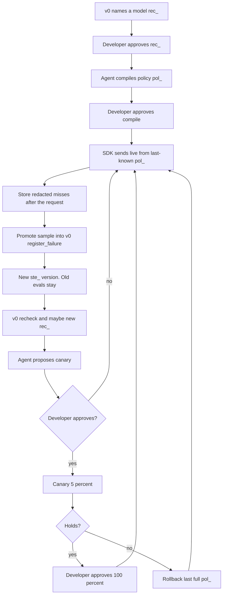

# EvalRouter Live — product spec (spec-driven)

**Status:** first version (v1)  
**Date:** 26 August 2026  
**Audience:** implementers and coding agents  
**Language:** ASD-STE100 Simplified Technical English. One idea in each sentence. One meaning for each word.

This file uses STE writing rules. A procedure sentence has 20 words or fewer. A description sentence has 25 words or fewer. Use the active voice. Use simple tenses. Do not use an -ing word as a verb.

If you need a term, define it the first time. Technical nouns are in section 1. Do not use pin, gold, glue, wedge, bake-off, Pareto, or IAA unless you define that word in the same paragraph. Do not use **router** for this product.

This file is the build contract for **EvalRouter Live**. Build Live from this file. Do not build Live from research notes.

EvalRouter **v0** stays frozen in [EVALROUTER_REQUIREMENTS.md](EVALROUTER_REQUIREMENTS.md). Do not edit that file to add Live. If this file and v0 disagree about v0 behavior, v0 wins. If this file and v0 disagree about the live hop, this file wins.

These research notes are not the spec:

- [build/pm-runtime-brief.md](build/pm-runtime-brief.md)
- [build/runtime-user-research.md](build/runtime-user-research.md)
- [build/runtime-competitive.md](build/runtime-competitive.md)
- [build/runtime-architecture.md](build/runtime-architecture.md)

[RUNTIME_BUILD.md](RUNTIME_BUILD.md) is the build order only. Do not put the build order in this file.

---


## How you use this product

This product is a **live hop** and a small **agent tool** API.

A live hop is the code that sends a real user request to a model. v0 is not a live hop. Live is a live hop.

Add a **TypeScript SDK** to the app. The app must call the SDK. The app must not call OpenRouter or Ramp directly. The SDK reads a **policy** from memory. The SDK sends the request with the **primary** model. If the vendor sends an error or a timeout, the SDK can try one **backup**. Tokens still go from the app to OpenRouter or Ramp, then to the model.

The **control plane** is the HTTP API of EvalRouter. The live request must not wait for the control plane.

The coding agent compiles a policy. The coding agent can promote a live miss into v0. The coding agent can propose a canary or a rollback. A person approves those changes on a screen. The agent must not apply live policy. CI must not apply live policy.

This product does not name a model. v0 names a model. Live sends requests with the model that a person approved.

This product is not a hosted proxy. This product is not a second OpenRouter. This product does not rewrite the prompt. This product does not select a model with a learned classifier. This product does not run evals on the user request.

---


## 1. Words we will use

Keep these v0 words: **eval**, **code eval**, **draft eval**, **trusted eval**, **eval set** (`ste_`). Also keep **run**, **named model**, **job**, **project**, **failure**, **recheck**, **cost cap**, **live traffic**, and `next_action`.

Add these technical nouns and verbs:

- **Live hop:** the path that a user request takes to a model. In v1 the live hop is the SDK in the app process.
- **Policy** (`pol_`): the compiled live instructions for one project. A policy has a primary model, 0 to 2 backups, a frozen `ste_`, a `rec_`, a time limit, and a canary state. A policy has a version. After you publish a policy, you must not change it.
- **Last-known policy:** the policy that the SDK has in memory and on local disk. The SDK uses this policy if the control plane is down.
- **Primary:** the model id that this policy sends by default. The primary is the named model from the approved `rec_`.
- **Backup:** a model that already passed the same trusted evals. Use a backup only after a vendor error or a timeout. A backup is not a secret extra primary.
- **Assessment:** the work that scores, collects, and recommends. Assessment is not on the live request. Assessment can be fast. Assessment must not add wait for the user.
- **Sample** (`smp_`): a redacted live miss. The SDK stores a sample after the user has a response. A sample is not an eval. A sample is not trusted.
- **Promote:** (v) make a sample into a v0 failure so that v0 can call `register_failure`. This makes a new `ste_`. Old evals stay.
- **Canary:** the new policy sends **5 percent** of live requests. The other requests stay on the last full policy. The hash uses `user_id`, or `request_id` if there is no `user_id`. If both ids are missing, send last full policy. Do not send canary. A canary is not an experiment studio.
- **Sticky:** the same `user_id` or `request_id` gets the same policy until the approved canary state changes.
- **Seal:** a check (HMAC) that the policy bytes are the bytes we published. Do not send a policy if the seal does not match.
- **Rollback:** (v) put the last full policy back at 100 percent. A rollback does not wait for an eval run. The control plane stores that state when the person approves. Each SDK loads it on the next timer, in 30 seconds or less.
- **Fail-open:** if the control plane is not available, send last-known policy that passed the seal check. Do not fail the user because we are down. Fail-open needs a verified last-known. If there is none, do not start.
- **Control loop:** agent tools and small approve screens. The control loop is not the user request.
- **Request loop:** SDK to vendor to model. The request loop has no evals, no agent, and no control-plane call.
- **p99 added latency:** the wait that Live adds, not the wait of the vendor. 99 percent of usual-path requests must stay at or below this limit.

Do not call evals “tests.” Do not call a policy a route. Do not call Live “OpenRouter.”

---


## 2. Product

**Name:** EvalRouter Live

Do not use Runtime or Serve as the product name. Runtime has the same sense as `run_evals` and as Node. Serve has the same sense as `evalrouter serve`.

**One line:** The app calls an SDK. Live requests use the approved named model. On error, the SDK can try one backup. The SDK sends redacted misses to EvalRouter. The SDK does not run evals on the request.

**Vision:** Use the model that v0 named. Learn from live misses. Change the live model only when a person approves.

**Use** means: the user request goes to the vendor with the primary from the approved recommendation. If that call has an error or a timeout, try one backup from the same recommendation.

**Learn** means: a redacted miss becomes a draft eval in v0. v0 makes a new eval-set version. v0 scores. v0 can name a new model. Live does not name a model.

**Change** means: a 5 percent canary, then 100 percent, or a rollback. A person approves. The SDK does not replace the primary by itself.

### Users

- **Coding agent** (Cursor, Claude Code, Codex, or a custom agent): This agent calls Live tools and v0 tools. It compiles policy. It promotes samples. It proposes a canary or a rollback. It follows `next_action`. After a person approves, it writes the SDK into the app. It does not mark. It does not invent trusted answers. It does not apply live policy. It does not sit on each user request.
- **Developer:** This person owns the AI feature. This person approves compile, canary, 100 percent, and rollback. This person can drop or promote a sample. This person uses v0 screens (accept, mark, named-model approve). This person must not be necessary on each live request.
- **Second person:** This role is the same as in v0. This person marks only when a program cannot score. This person does not compile. This person does not start a canary. This person does not roll back.
- **CI or timer:** This role is the same as in v0. It rechecks a frozen `ste_`. It fails the build. It does not apply live policy. It does not start a canary. It does not roll back.

An SRE is not a v1 user. There is no ops console.

---


## 3. The loop

v0 still does this work: describe, write evals, name a model. Live starts after a person approves a `rec_`.




**Start:** An approved `rec_` and a frozen `ste_` become a policy. The developer approves compile. The SDK sends live requests. Live traffic does not wait for evals.

**Miss:** The vendor sends an error or a timeout, or the app reports a bad output. The SDK stores a redacted sample after the response. The agent or the developer promotes it. v0 makes a new eval-set version. Full evals run after the request. Full evals do not run on live traffic.

**Change:** v0 can name a new model. That name is a new `rec_`. That `rec_` is not live. The agent proposes a 5 percent canary. The developer approves or rejects. If the canary causes more errors, roll back. If the canary is good, the developer approves 100 percent.

The first compile approve is different. It starts the hop at 100 percent. There is no 5 percent trial against a v0 `.env` model.

Teams can use v0 only. If you approve a named model in v0, that action does not start the live hop.

---


## 4. Goals

1. Live requests use the approved named model. On vendor error or timeout, the SDK can try one backup.
2. The hop is fast. Added wait must stay in the noise of time to first token. The SDK must send tokens as the vendor sends them.
3. A live miss can become a draft eval. The developer does not build a pipeline for this. Old evals stay.
4. Live policy changes only when a person approves. If the control plane is down, fail-open with a verified last-known.


### Not in first version

Read section 15.

---


## 5. Objects


| Object                  | Meaning                                                                                                               |
| ----------------------- | --------------------------------------------------------------------------------------------------------------------- |
| Project                 | The same as in v0. One AI feature.                                                                                    |
| Recommendation (`rec_`) | The v0 named model and 0 to 2 backups. Live uses this object. Live does not make this object.                         |
| Eval set (`ste_`)       | The frozen version that named the `rec_`. Live pins this version. Live does not edit this version.                    |
| Policy (`pol_`)         | Compiled live instructions. You must not change a published policy. A new `rec_` or a new `ste_` makes a new `pol_`.  |
| Sample (`smp_`)         | A redacted live miss. A sample is not trusted.                                                                        |
| Live report             | Short counts: live `pol_`, canary on or off, intended split, observed split, fallback rate, sample counts. No traces. |
| Last-known policy       | The `pol_` in SDK memory. This policy stays if the control plane is down.                                             |


---


## 6. Jobs and done-when

Each job is Given / When / Then. Then is the done check.

v0 keeps J1 through J8. Do not copy recheck here. After R4, the agent calls v0.

### R1 — Compile a policy from an approved named model

**Goal:** Make a v0 recommendation into a policy that the SDK can send.

**Given** an approved `rec_` and the frozen `ste_` that named that `rec_`.

**When** the agent calls `compile_policy`.

**Then** the product stores a `pol_`:

- `primary` is the named model on that `rec_`
- `backups` are the 0 to 2 backups on that `rec_` (each backup already passed)
- `eval_set_id` is that frozen `ste_`
- `recommendation_id` is that `rec_`
- `max_wait_ms` comes from the job limits

The policy is not live yet. `next_action` tells the human to open `approve_url`. If the human rejects, the SDK must not send this `pol_`.

If the project has no last full policy, compile approve makes this `pol_` last full at 100 percent. This starts the hop. Live does not canary against a v0 `.env` model. The old `.env` model is not on the hop.

If the project already has a last full policy, compile approve does not change live traffic. Then the agent must call `propose_rollout` with `intent: "canary"`.

Do not compile from a `rec_` that the developer rejected. Do not compile if `named_model` is null. Do not compile if the `ste_` is not the `ste_` on the `rec_`.

**Done:** a `pol_` exists. First compile approve can start the hop at 100 percent. A later compile approve does not put a new model at 100 percent.

### R2 — Send live requests from the cached policy

**Goal:** User requests use the primary. On error, use one approved backup. Do not run evals on the request.

**Given** an approved policy that is the last-known policy in the SDK.

**When** the app handles a live user request through the SDK.

**Then:**

1. Read last-known policy from memory. If a canary is approved, a sticky 5 percent slice uses the canary policy. The other requests use the last full policy. Hash `user_id` if it is present. If it is not present, hash `request_id`. If both ids are missing, send last full policy. Do not send canary. Do not call the control plane.
2. Call the vendor with that primary. Do not rewrite the prompt. Send the stream with no change.
3. If the vendor sends 5xx, 429, or timeout (`max_wait_ms` or time to first token), try **one** backup on that same policy. Do not retry 4xx from bad input. Do not try a second backup on this request. After the first token, do not try a backup. A backup after the first token would send two answers.
4. Return the user response. Do not run full evals. Do not run cheap program checks on this path in v1.
5. If the control plane is down, use last-known policy that passed the seal check. Fail-open.

**Done:** the request used only the cached policy. On the usual path, added work is a memory read and the vendor call that the app must make. Live evals did not run.

**Branches:**

- If the vendor succeeds on the primary, return.
- If the vendor sends an error or a timeout before the first token, try one backup. Then return.
- If all models on the policy fail, return the error to the app. Fail-open applies to our outage. Fail-open does not apply to a vendor outage.
- If there is no last-known policy that passed the seal check, the SDK must fail at startup. Do not select a model on a request.


### R3 — Collect live misses with no wait on the request

**Goal:** Keep a redacted miss so that you can promote it later. Do not make the user wait. Do not store raw traffic by default.

**Given** a live request that already has a response or a vendor error.

**When** one of these is true:

1. The vendor sent an error or a timeout. This includes the time after the backup.
2. The app tells the SDK that the output is bad (parse fail, missing field, or a guard in the app).

**Then** the SDK puts a **sample** in a queue after it returns the response. The request loop does not wait for upload.

A sample stores these fields: redacted input, redacted output or error, `pol_`, model id that failed, why (`vendor_error`, `timeout`, `app_reported`), and timestamp. Truncate the text. Do not store full traces. Do not store headers. Do not store cookies. Remove secret-shaped fields (keys, tokens, `authorization`). Remove or hash emails, phones, and card-like numbers.

Do not collect a sample for every successful request.

If redaction cannot store the example with safety, drop the example. Record `PII_BLOCKED` for the agent. Do not keep the raw example.

If the sample upload fails, drop the sample. Do not fail the user.

**Done:** a redacted sample exists, or the SDK dropped it. User wait did not include the upload. The product did not store raw live traffic.

### R4 — Promote a sample into v0 evals

**Goal:** A live miss becomes a draft eval on a new eval-set version. Live does not become the compiler.

**Given** a sample and the `ste_` on the live policy.

**When** the agent calls `promote_live_sample`, or the developer promotes on the sample screen.

**Then** Live sends the redacted example to v0 as a failure. v0 J5 holds. v0 makes a new `ste_`. v0 copies old evals. The previous `ste_` does not change. If there is a program check, or if the job type already has one that fits, the eval is a code eval. If a person must score it, the eval stays draft and needs mark.

A model can suggest a check. A program or a person must confirm. Live does not make a trusted eval by itself.

The same `idempotency_key` does not make a duplicate.

`next_action` is a v0 tool: `run_evals` or `queue_for_labeling`. Full evals run after the request. Full evals do not run on live traffic.

**Done:** v0 has a new `ste_` with the sample as an eval and with every old eval. Live policy does not change.

### R5 — Canary a new policy with a human gate

**Goal:** After v0 names a new model, send it to 5 percent only. A person must say yes first.

**Given** a new approved `rec_` that compiled to a new `pol_`. The last full policy still sends 100 percent.

**When** the agent calls `propose_rollout` with `intent: "canary"` and the developer approves.

**Then** the SDK sends the new policy to 5 percent of requests. The hash is sticky. The other requests stay on the last full policy. Intended percent is 5. The product reports observed percent. Assessment is still a memory read and that hash. Assessment is not an eval.

If the human rejects, live stays on the last full policy.

Do not start a canary because CI went green. Do not start a canary because the agent proposed it. Do not skip 5 percent and go to 100 percent in the first version. Do not set a missing percent to 50. First-version canary is 5 percent only.

**Holds** in the first version means this: the developer looks at the short report and the v0 eval report. The short report has sample counts, vendor errors, intended split, observed split, and fallback rate. There is no auto-promote. There is no significance test.

**Done:** 5 percent is on the new `pol_`, or live did not change. The product did not replace the primary by itself.

### R6 — Roll back, or set canary to 100 percent, with a human gate

**Goal:** If the canary causes more errors, put last full policy at 100 percent. If the canary is good, a person can move to 100 percent.

**Rollback.** Given a live canary, or a live full policy that the developer wants off.

**When** the agent calls `propose_rollout` with `intent: "rollback"` and the developer approves, or the developer selects rollback on the screen.

**Then** the control plane sets last full policy to 100 percent when the person approves. There is no eval run. Each SDK loads that policy on the next timer, in 30 seconds or less. Until then, last-known stays. If that get fails, last-known stays. The developer can put a last-known file in place.

**Set to 100 percent.** Given an approved canary.

**When** `propose_rollout` with `intent: "full"` and the developer approves.

**Then** the canary policy becomes the last full policy at 100 percent.

The agent must not apply `full` or `rollback` if a person did not approve. CI must not call this tool.

**Done:** live is last full policy at 100 percent (rollback), or the new policy at 100 percent (full). A person did this.

---


## 7. Agent tools (first version)

The contract is the same as v0. An agent tool is a JSON function that the model calls. HTTP is `POST /v1/tools/{name}`. The JSON body is the same. MCP uses the same body. `additionalProperties` is `false`. The agent branches on enums. Each reply has `next_action`. A call that changes data has `idempotency_key`. Output is small. Ids are opaque. Truncate text. Do not send full traces.

Do not add these names to the seven v0 tools. Call v0 tools for evals. Live is a small control loop on top.


| Tool                  | Job    | Notes                                                                                                                                                                                |
| --------------------- | ------ | ------------------------------------------------------------------------------------------------------------------------------------------------------------------------------------ |
| `compile_policy`      | R1     | `rec_` and `ste_` make a `pol_`. This tool does not send live traffic. This tool returns `approve_url`.                                                                              |
| `get_live_report`     | R2–R6  | Live `pol_`, canary on or off, intended split, observed split, fallback rate, sample counts, last-known age, `report_url`. Paginate samples. No traces. The payload fits in context. |
| `promote_live_sample` | R4     | A sample becomes a v0 failure. Then `next_action` is v0 `run_evals` or `queue_for_labeling`.                                                                                         |
| `propose_rollout`     | R5, R6 | `intent`: `canary` or `full` or `rollback`. This tool does not apply. This tool returns `approve_url`. CI does not call this tool.                                                   |


There is no `apply_live_policy`. There is no `set_canary`. Apply is a screen.

Capture from the SDK is not a fifth tool. The SDK uploads samples. Promote uses R4. That path uses v0 J5 rules.

### Shared rules

- `additionalProperties` is `false` on inputs
- Opaque ids: `prj_`, `ste_`, `rec_`, `pol_`, `smp_`
- If work takes more than 2 seconds, do it after the tool returns
- A call that changes data has `idempotency_key`
- Truncate `input` and `output`. Do not send full traces
- `live_traffic_changed` is `false` on tools that cannot change traffic. This field becomes true only after a person approves compile, canary, full, or rollback, and the SDK has loaded that policy. The tool call that proposes still returns `false`.

`next_action` shape:

```jsonc
{
  "tool": "compile_policy" | "get_live_report" | "promote_live_sample" | "propose_rollout"
        | "register_failure" | "run_evals" | "queue_for_labeling" | "get_eval_report"
        | "recommend_models" | "get_label_status" | null,
  "args": {},
  "ask_human": null | "open approve_url" | "open mark_url" | "open sample_url"
}
```


### Call order

**Connect the live hop (after v0 named a model):**

1. Call `compile_policy`.
2. Stop. `ask_human`: open `approve_url`.

**After a live miss:**

1. Call `get_live_report`.
2. Call `promote_live_sample`.
3. Then call v0. Use `run_evals` or `queue_for_labeling` as `next_action` says.

**After v0 names a new model:**

1. Call `compile_policy`.
2. Call `propose_rollout` with `intent: "canary"`.
3. Stop. `ask_human`: open `approve_url`.

The agent never applies live policy.

---


## 8. Screens (not tools)

Each screen is small. Each screen shows one object. Do not show a table of live traffic.

- **Compile approve.** Show primary, backups, `rec_`, and `ste_`. Approve or reject. Approve does not rewrite the prompt. If no last full policy exists, approve lets the SDK load this `pol_` as last full. Canary is off. If a last full policy exists, approve only stores the draft `pol_`. Canary stays off until R5.
- **Sample.** Show one redacted sample. Promote or drop. The developer can paste a program check. This screen is not a traffic explorer.
- **Rollout approve.** Show old `pol_`, new `pol_`, and intent (canary 5 percent, full, or rollback). Show intended split, observed split, and fallback rate. Show a link to the v0 report and the rollback target. Approve or reject.
- **Read-only report URL.** Show counts only. This page is permitted. This page is not a dashboard.

Developer draft-accept, mark, and named-model approve stay in v0.

---


## 9. The SDK hop

**Join:** a TypeScript SDK in the app process. The app keeps its vendor key. Live does not sell tokens.

**Not in v1:** a hosted proxy, a Go sidecar, a Python SDK, an OpenRouter plugin, or live traffic through `evalrouter serve`.

**Policy load:** load at process start. Load again on a timer of 30 seconds or less. Do not load on the user request. Verify the seal. Replace the policy pointer in one step. Keep the previous policy for rollback.

If the seal on `GET` fails, keep last-known. Do not replace the pointer. Record `CONTROL_PLANE_UNREACHABLE`.

If the seal on the last-known file fails at start, do not send. Do not select a model. Record `NO_LAST_KNOWN_POLICY`.

If the seal key changes, keep last-known that verifies with the old key. A person must place a new last-known file.

**Many processes:** each app process has its own last-known. Processes can differ until the next successful `GET`. This is accepted in v1. Do not add a shared store.

**If the control plane is down:** continue to send last-known policy that passed the seal check. Write samples to disk. If the disk queue is full, drop samples. Do not send 5xx to the user because v0 is down.

**If there is no last-known policy that passed the seal check:** do not start to send. Do not select a model.

**Stream:** send tokens as the vendor sends them. Do not hold the full body before the first token. Collect samples after tokens are on the wire. Try a backup only before the first token.

**Fallback limit:** at most one extra model call for each user request.

---


## 10. Latency and safety bars

These bars are product acceptance. These bars are not unit tests.

### Latency

- On the usual path, **p99 added latency is 5 ms or less**. Added wait is the work of Live, not the vendor model call. The target in the app process is much less than 1 ms.
- Do not count vendor time.
- Do not count backup model time. A backup is a second vendor call after a miss.
- Sample queue p99 is less than 1 ms. Upload is after the response. Upload is not in the 5 ms budget.
- Policy refresh is on a timer. Policy refresh is not on the request.
- Assessment on the request is one memory read, and a hash if canary is on. There is no model. There is no eval. There is no embedding.


### Safety

- Do not replace the primary if a person did not approve. Compile, canary, and 100 percent each have `approve_url`.
- You can use a backup on vendor error. Those backups came from the same approved `rec_`.
- The first compile approve starts the hop at 100 percent. After that, a new `rec_` is not live until R5 or R6 approve.
- CI never applies live policy.
- Fail-open: if the control plane is down, use last-known policy that passed the seal check.
- If there is no last-known policy that passed the seal check, do not start. Do not select a model.
- If the seal on `GET` fails, keep last-known. Do not send the new bytes.
- If `user_id` and `request_id` are both missing, send last full policy. Do not send canary.
- Store redacted samples only. Truncate. Remove secrets. Do not store full traces. `PII_BLOCKED` drops the raw example.
- Live does not mark. Live does not invent trusted evals.
- Live does not rewrite the prompt.
- Rollback does not wait for evals. Each SDK can take up to 30 seconds to load the new last full policy.
- Canary 5 percent is an integer. If parse fails, stay on the last full policy. Do not set the percent to 50.
- Intended canary split and observed canary split both show on `get_live_report`.

---


## 11. Errors the agent can handle

Use a closed enum. The agent branches on `code`. The agent does not parse `message`. Each error has `next_action`.


| code                        | meaning                                                                                                 | next                                                                                    |
| --------------------------- | ------------------------------------------------------------------------------------------------------- | --------------------------------------------------------------------------------------- |
| `POLICY_NOT_APPROVED`       | A draft `pol_` exists. It is not live.                                                                  | `ask_human` open `approve_url`                                                          |
| `REC_NOT_APPROVED`          | No person approved the `rec_`, or a person rejected it                                                  | v0 named-model screen                                                                   |
| `STE_MISMATCH`              | The `ste_` is not the `ste_` on the `rec_`                                                              | Fix args                                                                                |
| `NO_LAST_KNOWN_POLICY`      | The SDK has no last-known policy that passed the seal check                                             | `compile_policy` then approve                                                           |
| `CANARY_NOT_ACTIVE`         | The call needs `full` or observed split, and there is no canary                                         | `propose_rollout` canary, or report                                                     |
| `NOT_A_SAMPLE`              | The id is not a sample                                                                                  | `get_live_report`                                                                       |
| `PII_BLOCKED`               | Capture did not store the example                                                                       | Redact or drop. Do not register raw data                                                |
| `CONTROL_PLANE_UNREACHABLE` | Policy refresh failed, sample upload failed, or the seal on `GET` failed                                | The live hop still uses last-known policy. The agent reports. Do not fail user requests |
| `LIVE_HOP_DISABLED`         | The SDK is present. The hop is not on.                                                                  | Compile approve screen                                                                  |
| v0 codes                    | `need_more_evals`, `need_new_model`, `does_not_work`, `evals_missing_new_failures`, `COST_CAP_EXCEEDED` | The same as in v0                                                                       |


Live never invents a named model when these codes occur. Live does not name models.

---


## 12. Relationship to v0

v0 is the **compiler**. v0 writes evals. v0 takes marks. v0 names the cheapest fast model that still passes. v0 rechecks. Live user requests never go through v0. That rule stays true.

Live is the **executor of a compiled policy**. Live uses `rec_` and frozen `ste_`. Live does not name a model. Live does not mark. Live does not edit a frozen `ste_`. Live does not run `run_evals` on the live request.

```
v0:   agent tools → rec_ + ste_
Live: rec_ + ste_ → pol_ → SDK → OpenRouter → model
Live: live miss → sample → v0 register_failure → new ste_ → v0 run → new rec_
```

Keys: use customer keys to OpenRouter, as in v0. The SDK uses the vendor key of the app for live calls. The Live API key is only for policy refresh and sample upload.

You can use v0 with no Live. A green v0 recheck still does not change live traffic. Live changes live traffic only after R1, R5, or R6 approve.

Do not fork scoring. Do not fork eval-set versions. Do not add Live-only “trusted” flags that skip the two-person mark in v0.

---


## 13. The first version is complete when

- The agent can compile a policy from an approved `rec_` and stop at the approve screen.
- After approve, the SDK sends that primary. The SDK does not call the control plane on the request.
- If the vendor sends an error or a timeout before the first token, the SDK tries one backup from the same `rec_`.
- The SDK sends tokens as the vendor sends them. The hop does not hold the full body to score it.
- On the usual path, p99 added latency is 5 ms or less in the demo harness.
- An app-reported miss or a vendor miss becomes a redacted sample after the response.
- Promote makes a new `ste_` with the sample and every old eval. Live policy does not change.
- v0 recheck and recommend still work. CI still does not apply live policy.
- A 5 percent canary needs a person. The product reports observed split. A missing percent does not become 50. If both hash ids are missing, last full policy is sent.
- 100 percent and rollback need a person. Rollback does not wait for evals. Each SDK can take up to 30 seconds to load.
- If you stop the control plane in the demo, the app still answers from last-known policy that passed the seal check.
- If there is no last-known policy that passed the seal check, the SDK does not start. The SDK does not select a model.
- No process rewrote the prompt. No learned pick ran. No full eval ran on a live request.
- All copy uses the words in section 1.


### Success after 14 days

Last-known policy still sends if the control plane stops for a short time. New live misses are in the eval set, or the report lists them as missing. If canary is on, observed canary is near 5 percent. The named model did not change while the developer was away.

---


## 14. Primary demo

An invoice-JSON app already has a v0 named model and a frozen `ste_` of code evals.

1. In Cursor, the agent compiles a policy.
2. You approve.
3. The SDK sends live requests. The primary goes to OpenRouter. If you stop the primary id, the SDK tries one backup.
4. A live body does not have `total_cents`. The app reports that the output is bad. The user already has a response.
5. A redacted sample shows. The agent promotes it.
6. v0 has a new `ste_` with every old eval and this eval.
7. Recheck of the old named model fails. v0 names a backup that passes.
8. You approve a 5 percent canary, then 100 percent.
9. You approve rollback. The control plane sets last full policy. The SDK loads it on the next timer.
10. Stop the control plane. The app still answers from last-known policy that passed the seal check.

Show that no full eval ran on a live request. Show that the agent did not apply a new primary. You used the approve screen.

---


## 15. Out of scope

- Do not put a hosted proxy in front of OpenRouter, Ramp, or the model company.
- Do not send live user requests through v0 `evalrouter serve`.
- Do not make a second OpenRouter (catalog, billing, or sale of tokens).
- Do not add per-request selection rules (user tier, prompt length, region, or a classifier).
- Do not select a model for each token.
- Do not use a learned model picker (Not Diamond, RouteLLM, or Auto style).
- Do not rewrite the prompt.
- Do not replace the primary if a person did not approve.
- Do not run full evals, cheap program checks, fixture exec, or LLM-as-judge on the live request.
- Do not collect a sample for every successful request.
- Do not make an eval dashboard, a live analytics studio, or an SRE console.
- Do not use crowd marking.
- Do not change v0 jobs, v0 tools, or frozen eval-set history.
- Do not let CI apply a policy, start a canary, or roll back.
- Do not ship a Python SDK, a Go SDK, a sidecar process, or a local reverse proxy in v1. You can add them later with the same policy JSON.
- Do not use canary fractions other than 5 percent then 100 percent.
- Do not auto-promote a canary to 100 percent.
- Do not make a rate-limit product.
- Do not select a live model from cost.
- Do not switch the model in the middle of a stream.
- Do not make an A/B test platform.
- Do not run WASM checks on the hop.
- Do not add extra tools (`compare_models`, trace ingest, drift detect, `apply_live_policy`).

