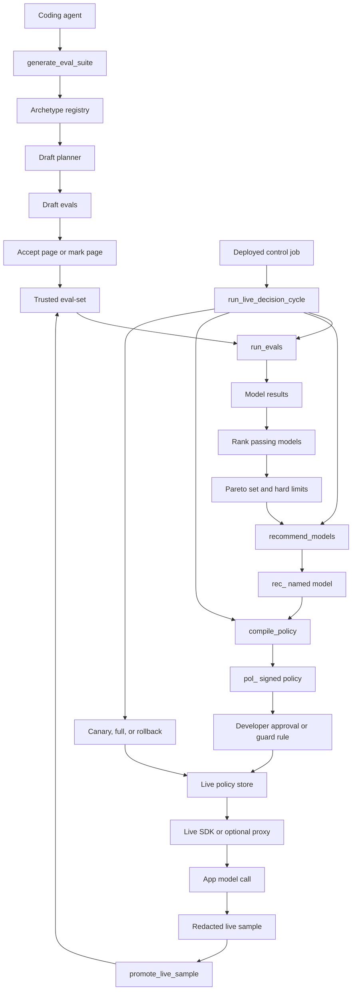

# EvalRouter

EvalRouter helps an AI coding agent choose a model for one AI feature.

It is an agent tool and an HTTP API.
The agent calls it with repo context, prompts, schemas, examples, failures, and notes.
EvalRouter makes draft evals from that evidence.
It runs trusted evals against models.
It recommends one named model for the app.

EvalRouter can also serve a live signed policy.
The app uses that policy through the SDK or optional proxy.
A deployed control job can update that policy in guarded mode.

## Who it is for

EvalRouter is for teams that add AI features to real products.

It is useful when:

- A coding agent writes or changes an AI feature.
- A developer needs evidence before a model change.
- A team wants a cheaper or faster model that still passes evals.
- A team wants human review for subjective evals.
- A team wants safe live model updates with clear guard rules.

It is not an eval dashboard.
It is not a prompt rewrite system.
It is not a learned per-request picker.
It does not trust a model-only judge.

## Main idea

An **eval** is one product check on one example.
The input goes in.
A score says if the model did the job.

An **archetype** is an eval pattern.
It tells the agent what evidence to give.
It tells EvalRouter which scorer primitive can apply.

A **scorer primitive** is a small program check.
It returns pass or fail for one model output.

A **named model** is the model id that the app will use.
The coding agent writes that model id into the app config.

A **policy** is a signed live config.
It names the primary model, backups, and limits.

A **Pareto set** is a short model list.
In that list, no model loses to another model on quality, time, and cost at once.

## Architecture



## What it does

### 1. Draft evals

Call `generate_eval_suite`.

The input can include:

- `description`
- `system_prompt`
- `sample_files`
- `labeled_examples`
- `what_good_means`
- `archetype_ids`
- `custom_archetypes`
- `evidence`

EvalRouter selects archetypes from explicit ids first.
Then it uses evidence and description.
It uses schemas and labels before keyword guesses.
It returns `JOB_UNCLEAR` when it cannot draft a useful eval.

### 2. Route trust

A deterministic program check can become trusted after accept.
A person eval needs marks.
A model-only check never becomes trusted.

EvalRouter stores eval-set versions.
New work can copy old evals forward.
A registered failure can become a new eval.

### 3. Run models

Call `run_evals`.

EvalRouter runs trusted evals under a spend cap.
It scores code evals with scorer primitives or fixtures.
It reuses person marks from the eval-set version.

### 4. Recommend a model

Call `recommend_models`.

EvalRouter applies hard limits.
It ranks models that pass all trusted evals.
It chooses the cheapest fast passing model.
A costlier or slower model wins only with clear quality lift.

### 5. Serve live policy

Call `compile_policy`.

EvalRouter creates a signed policy from the recommendation.
Approval controls when live traffic can use that policy.
The app reads the policy through the SDK or optional proxy.

### 6. Update live policy in guarded mode

Call `configure_live_automation`.

A deployed control job can call `run_live_decision_cycle`.
The cycle checks approved guard rules.
It can publish a 5 percent canary.
It can promote a canary to full.
It can roll back to the last full policy.

Rollback has priority over promotion.
Manual mode never changes live policy.

## Built-in archetypes

The V1 registry includes these archetypes:

- `output_contract`
- `extraction_transform`
- `classification_route`
- `tool_call`
- `tool_result_use`
- `rag_retrieval`
- `grounded_answer`
- `citation_quality`
- `math_exact`
- `code_functional`
- `conversation_task`
- `agent_trajectory`
- `safety_policy`
- `fairness_invariance`
- `cost_latency_fit`

Use `custom:<slug>` for a project archetype.
The coding agent must pass its definition in `custom_archetypes`.

## How to run locally

Use Node.js 22 or newer.

```bash
npm ci
EVALROUTER_KEY=replace-with-a-local-secret npm start
```

Optional environment variables:

```bash
EVALROUTER_SQLITE=./evalrouter.sqlite
EVALROUTER_BASE_URL=http://127.0.0.1:3000
PORT=3000
```

Run checks:

```bash
npm test
npm run build
```

## How to use with an agent

Add the MCP server config from `examples/mcp.json`.

The same JSON works over MCP and HTTP.
HTTP uses this route:

```text
POST /v1/tools/{tool_name}
```

Each mutating tool needs `idempotency_key`.
Each tool returns `next_action`.
The agent must follow `next_action`.

## Basic flow

1. Call `generate_eval_suite`.
2. Open the `accept_url`.
3. Accept deterministic program checks.
4. Queue person marks when needed.
5. Call `run_evals` with a spend cap.
6. Call `get_eval_report`.
7. Call `recommend_models`.
8. Write the named model into app config.

## Live flow

1. Call `compile_policy` from a recommendation.
2. Approve the signed policy.
3. Use the SDK or optional proxy in the app.
4. Call `get_live_report` to inspect live state.
5. Promote safe live samples into evals when needed.
6. Configure guarded automation when the team wants auto update.
7. Run `run_live_decision_cycle` from a deployed control job.

## Example eval request

```json
{
  "description": "Return JSON for a support route.",
  "archetype_ids": ["output_contract", "classification_route"],
  "evidence": {
    "schemas": [
      {
        "fields": ["label", "reason"]
      }
    ],
    "labels": ["billing", "technical", "sales"]
  },
  "idempotency_key": "suite-001"
}
```

## Safety boundaries

EvalRouter does not secretly author trusted evals.
The coding agent drafts evals from evidence.
A person accepts or marks the evals.

EvalRouter does not sit in front of live traffic by default.
The SDK path is the default live path.
The optional proxy uses the same signed policy engine.

EvalRouter does not run evals on a live user request.
Live samples are redacted before storage.

## Why use it

EvalRouter makes model choice evidence-based.
It reduces brittle eval generation.
It keeps subjective judgment with people.
It keeps live model changes inside guard rules.
It gives the app one named model or one signed policy.
It gives the team a report that fits in agent context.
