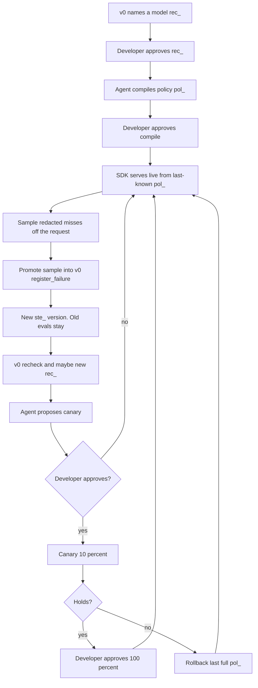

# EvalRouter Serve — PM brief (Runtime v1)

**Status:** brief for a spec. Not the spec. Not a build order.  
**Date:** 26 August 2026  
**Audience:** whoever writes `EVALROUTER_RUNTIME_REQUIREMENTS.md`  
**Language:** short sentences. Everyday technical words. One idea per sentence.

If a term is needed, define it the first time. Do not use pin, gold, glue, wedge, bake-off, Pareto, or IAA unless that word is defined in the same paragraph.

EvalRouter v0 is shipped and frozen. Do not rewrite `EVALROUTER_REQUIREMENTS.md`. Do not edit `spec/`. This brief is a second product.

v0 one-liner, for contrast: a tool a coding agent calls to check an AI feature with evals, name the cheapest fast model that still passes, and run that check again when the feature changes.

---

## How to cut

The brainstorm listed twelve capabilities. First version is not all twelve.

Keep only what closes one loop:

**Named model in, live requests out, a live miss back into evals, a new policy live only after a person says yes.**

That needs a way to join the app, a compiled policy, fallback on error, sampled failure capture with redaction, a handoff into v0, and a human-gated canary with rollback.

Cut the rest. Reasons sit in section 6.

---

## 1. One-line and vision

**Name:** EvalRouter Serve (working name was EvalRouter Runtime). See section 12.

**One line:** An SDK the app calls so live requests use the approved named model, fall back on error, and send redacted misses back to EvalRouter, without running evals on the request.

**Vision:** Serve the model v0 already named. Learn from live misses. Change the live model only when a person approves.

Serve means: the user request goes to OpenRouter (or the vendor) with the primary model from the approved recommendation. If that call errors or times out, try a backup from the same recommendation. Full evals do not run here.

Learn means: a sampled, redacted miss becomes a draft eval in v0. v0 versions the eval set, scores, and may name a new model. Serve does not name a model.

Change means: a new policy canary, then full, or rollback. A person approves. The SDK does not swap the primary by itself.

---

## 2. How it joins the app

**SDK, not a hosted proxy.**

A **hosted proxy** is our server in front of OpenRouter. Every live request would hop through us. That makes us a second OpenRouter. Out of first version.

An **SDK** is a library in the app. The app calls the SDK instead of calling OpenRouter itself. The SDK picks the model from a cached policy, calls OpenRouter, and may retry a backup. Tokens still go: app → OpenRouter or Ramp → model.

EvalRouter’s control plane is not on that path. The **control plane** is the Serve API that compiles policies and receives samples. The live request must not wait on it.

**TypeScript / Node SDK in first version.** Same language as v0. The coding agent can add it. Python, Go, and a local sidecar wait.

How install works:

1. Developer (or agent after approval) adds the SDK.
2. App passes `project_id` and a key used only to refresh policy and to upload samples.
3. SDK loads a **policy** (see words below) into process memory. It refreshes in the background. It does not fetch policy on each user request.

The coding agent is in the **control loop**. It compiles, promotes samples, and proposes canary or rollback. It is not in the **request loop**. Each user request does not call an agent tool.

Teams may keep using v0 only. v0 still writes a model id into `.env`. Serve is optional. Approving a named model in v0 does not start live serving.

---

## 3. Words we will use

- **Eval, eval set (`ste_`), named model, recommendation (`rec_`), run, recheck, draft eval, trusted eval, live traffic:** same meanings as v0.
- **Policy:** compiled live instructions for one project (one AI feature). Primary model, 0–2 backups, the frozen `ste_` this was checked on, the `rec_` it came from, and the job’s time limit. Versioned. Id prefix `pol_`.
- **Last-known policy:** the policy the SDK has in memory (or on local disk). Used if the control plane is down.
- **Sample:** a redacted live example stored after the user already got a response. Not an eval. Not trusted.
- **Promote:** turn a sample into a v0 failure so v0 can `register_failure`. That makes a new `ste_` version. Old evals stay.
- **Canary:** the new policy serves a fixed slice of live requests (10%). The rest stay on the last full policy. Not a stats product.
- **Rollback:** put the last full policy back at 100%. Immediate. No eval run required.
- **Assessment:** choosing which model this request will use. In first version that is: read the cached policy, and if a canary is on, a 10% coin flip. Not an eval. Not a learned pick.
- **Fail-open:** if Serve’s control plane is unreachable, the user request still goes to OpenRouter with the last-known policy. Do not fail the user because we are down.
- **Control loop:** agent tools + tiny approve screens. Not the user request.
- **Request loop:** SDK → OpenRouter → model. No full evals. No agent.

---

## 4. Users

### Coding agent

May: call Serve tools. Compile a policy from an approved `rec_` and frozen `ste_`. List samples. Promote a sample (which hands off to v0). Propose a canary or rollback. Follow `next_action` into v0 tools (`register_failure`, `run_evals`, `recommend_models`, `get_eval_report`).

Must not: mark evals. Accept drafts. Invent trusted answers. Apply a new primary without a person. Rewrite the prompt. Sit on each user request.

### Developer

Owns the AI feature. Same person as v0.

May: approve or reject compile. Approve or reject canary. Roll back. Drop or promote a sample. Use v0 screens (draft accept, mark, named-model approve). Open the short runtime report URL.

Must not: be required on each live request. Drop old evals to make a new policy look good. Approve a policy whose `rec_` failed trusted evals.

### Second person

Unchanged from v0. Marks only when a program cannot score. Does not compile policies. Does not canary. Does not roll back.

### CI or timer

Unchanged from v0 on evals: recheck the frozen `ste_`. Fail the build if the named model now fails. Do not name a model. Do not write config.

Must not: apply a live policy. Start a canary. Roll back. CI failing the build is not a live swap.

### SRE

Not a first-version user. No ops console. Developer rolls back. A read-only report URL is enough.

---

## 5. The loop

v0 still does describe → evals → name. Serve starts after a person approves a `rec_`.



**Start serve:** Approved `rec_` plus frozen `ste_` become a policy. Developer approves compile. SDK serves. Live traffic does not wait on evals.

**Miss:** Vendor error, timeout, or the app reports a bad output. SDK stores a redacted sample after the response. Agent or developer promotes it. v0 creates a new eval-set version. Full evals run in the background.

**Change:** v0 may name a new model. That is a new `rec_`. It is not live. Agent proposes a 10% canary. Developer approves or rejects. If the canary hurts, rollback. If it holds, developer approves 100%.

---

## 6. Jobs (first version)

These are Serve jobs. v0 keeps its own J1–J8 in `EVALROUTER_REQUIREMENTS.md`.

Four to six jobs. Six is the cut. Recheck is v0 J7. Do not duplicate it here. The agent calls v0 after R4.

### R1 — Compile a policy from an approved named model

**Goal:** Turn a v0 recommendation into something the SDK can serve.

**Given** an approved `rec_` and the frozen `ste_` it was named on.

**When** the agent calls `compile_policy`.

**Then** the product stores a `pol_`:

- `primary` is the named model on that `rec_`
- `backups` are the 0–2 backups on that `rec_` (each already passed)
- `eval_set_id` is that frozen `ste_`
- `recommendation_id` is that `rec_`
- `max_wait_ms` comes from the job limits

The policy is not live yet. `next_action` asks the human to open `approve_url`. Reject means this `pol_` is not served.

Do not compile from a `rec_` the developer rejected. Do not compile if `named_model` is null. Do not compile if the `ste_` is not the one on the `rec_`.

**Done:** a `pol_` exists. Live traffic is unchanged until the developer approves and the SDK loads it.

### R2 — Serve live from the cached policy

**Goal:** User requests use the primary. On error, use an approved backup. No evals on the request.

**Given** an approved policy loaded as last-known policy in the SDK.

**When** the app handles a live user request through the SDK.

**Then:**

1. Assessment is a memory read of the last-known policy. If a canary is approved, a 10% slice uses the canary policy. The rest use the last full policy.
2. The SDK calls OpenRouter (or the vendor) with that primary. It does not rewrite the prompt.
3. If the vendor returns an error, or `max_wait_ms` is hit, the SDK tries the next backup on that same policy. Backups were already approved with the `rec_`. This is recovery, not a model change.
4. The user response is returned. Full evals do not run. The control plane is not called on this path.
5. If the control plane is down, use last-known policy. Fail-open.

**Done:** the request used only the cached policy. Added work on the happy path is a memory read plus the vendor call the app was going to make anyway. Live evals did not run.

**Branches:**

- Vendor success on primary → return. Maybe sample nothing.
- Vendor error or timeout → backup, then return.
- All models on the policy fail → return the error to the app. Still fail-open toward the user from *our* outage, not from the vendor’s.
- No last-known policy yet → SDK errors to the app at startup, not mid-request after serving has begun.

### R3 — Sample live misses without blocking the request

**Goal:** Keep a redacted miss we can promote later. Do not slow the user. Do not store raw traffic by default.

**Given** a live request that already has a response (or a vendor error).

**When** one of these is true:

1. The vendor errored or timed out (including after backups).
2. The app tells the SDK the output is bad (parse fail, missing field, guard in the app).

**Then** the SDK enqueues a **sample** after the response is returned. The request loop does not wait on upload.

A sample stores: redacted input, redacted output or error, `pol_`, model id that failed, why (vendor_error, timeout, app_reported), timestamp. Truncate. No full traces. No headers. No cookies. Secret-shaped fields stripped (keys, tokens, `authorization`).

Do not sample every successful request. That is a log product. Out of first version.

If the sample upload fails, drop it. Do not retry on the request loop. Do not fail the user.

**Done:** a redacted sample exists or was dropped. User latency did not include the upload. Raw live traffic was not stored.

### R4 — Promote a sample into v0 evals

**Goal:** A live miss becomes a draft eval on a new eval-set version. Serve does not become the compiler.

**Given** a sample and the `ste_` on the live policy.

**When** the agent calls `promote_live_sample` (or the developer promotes on the sample screen).

**Then** Serve hands the redacted example to v0 as a failure. v0 J5 holds: new `ste_`, old evals copied, previous `ste_` unchanged. If a program check is supplied (or the job type already has one that fits), it is a code eval. If a person must score it, it stays draft and needs mark.

A model may suggest a check. A program or a person must confirm. Serve does not create a trusted eval by itself.

Same `idempotency_key` does not duplicate.

`next_action` is a v0 tool: `run_evals` or `queue_for_labeling`. Full evals run in the background. Not on live traffic.

**Done:** v0 has a new `ste_` with the sample as an eval plus every old eval. Live policy is unchanged.

### R5 — Canary a new policy with a human gate

**Goal:** After v0 names a new model, serve it to 10% only. A person says yes first.

**Given** a new approved `rec_` (v0 ran on the new `ste_`, developer approved the name) and a compiled new `pol_`. The last full policy is still serving 100%.

**When** the agent calls `propose_rollout` with `intent: "canary"` and the developer approves.

**Then** the SDK serves the new policy to 10% of requests. The rest stay on the last full policy. Assessment is still a coin flip plus a memory read. Not an eval.

Reject means live stays on the last full policy.

Do not start a canary because CI went green. Do not start a canary because the agent proposed it. Do not skip 10% and jump to 100% in first version (100% is R6’s promote, still gated).

**Holds** in first version means: developer looks at the short report (sample counts, vendor errors) plus the v0 eval report. There is no auto-promote. There is no significance test.

**Done:** either 10% is on the new `pol_`, or live is unchanged. Primary was not auto-swapped.

### R6 — Rollback, or promote canary to 100%, with a human gate

**Goal:** Hurt → last full policy now. Hold → person may move to 100%.

**Rollback. Given** a live canary, or a live full policy the developer wants off.

**When** the agent calls `propose_rollout` with `intent: "rollback"` and the developer approves, or the developer hits rollback on the screen.

**Then** last full policy is 100% immediately. No eval run. No wait on the control plane beyond the approve itself. SDKs that cannot reach the control plane keep last-known until they can; rollback must still be pushable as a cached policy refresh. If refresh fails, the developer can place a last-known file. Product bar: rollback does not require a full eval run.

**Promote to 100%. Given** an approved canary.

**When** `propose_rollout` with `intent: "full"` and the developer approves.

**Then** the canary policy becomes the last full policy at 100%.

The agent must not apply `full` or `rollback` without that approve step. CI must not call this.

**Done:** live is either last full policy at 100% (rollback) or the new policy at 100% (promote). A person did it.

---

## 7. In first version / out of first version

### In

- TypeScript / Node SDK in the app
- Compile `pol_` from approved `rec_` + frozen `ste_`
- Serve primary + approved backups on vendor error or timeout
- Fail-open. Last-known policy if control plane down
- Async redacted samples on vendor miss or app-reported miss
- Promote sample → v0 `register_failure` (new `ste_`, old evals stay)
- Background v0 run / recheck / recommend (agent or CI). Not on the live request
- 10% canary then 100%, each with a person
- Immediate rollback with a person
- Agent tools with `next_action`. Same JSON on MCP and `POST /v1/tools/{name}`
- Tiny screens: compile approve, sample promote/drop, canary/full/rollback approve, read-only report URL
- p99 added-latency bar and the safety bars in section 8

### Out

- A hosted proxy in front of OpenRouter, Ramp, or the vendor
- A second OpenRouter (catalog, billing, resale of tokens)
- Per-request routing rules (user tier, prompt length, region, a classifier)
- Per-token model pick
- A learned router
- Prompt rewrite
- Auto-swap of the primary without a person
- Full evals on the live request
- Sampling every successful request
- An eval dashboard, live analytics studio, or SRE console
- Crowd marking
- Changing v0 jobs, v0 tools, or frozen eval-set history
- CI applying a policy, starting a canary, or rolling back
- Python / Go SDKs, a sidecar process, a local reverse proxy
- Canary fractions other than 10% then 100%
- Auto-promote canary to 100%
- Rate-limit product (we do not sit in front of the vendor’s limiter)
- Multi-region Serve SLA as a product
- Cost-based live routing
- Streaming token switch mid-response
- A/B test platform

**Why those cuts (short):**

| Cut | Why |
| --- | --- |
| Hosted proxy | Extra hop. We become the vendor. Breaks the latency bar. v0 already forbade a second OpenRouter. |
| Per-request rules / learned router / per-token pick | That is a different product. Assessment must stay a cache read. |
| Full evals on the request | Founder bar. Also too slow. |
| Dashboard / SRE console | v0 already refused a full eval website. Report URL + agent tool is the surface. |
| Auto-swap | Same as v0. Recommend is not apply. |
| Prompt rewrite | v0 out. Still out. |
| Success logging | Privacy and a log product. Misses are enough to close the loop. |
| Other languages / sidecar | Agent UX in Node first. Do not fork the policy shape. |
| Fancy canary | 10% or back. A person looks. Not an experiment studio. |

---

## 8. Latency and safety product bars

These are product acceptance, not unit tests.

### Latency

- **Happy path p99 added latency ≤ 10 ms.** Added means Serve’s work besides the vendor model call. Policy is in memory. No control-plane HTTP on the request.
- Do not count OpenRouter time.
- Do not count backup model time. Backup is a second vendor call after a miss. That miss already broke the user’s wait. The bar is: we did not add a third wait of our own.
- Sample upload starts after the response is handed to the app. It is not in the 10 ms budget.
- Policy refresh is background. Interval, not per request.
- Assessment is O(1). No model. No eval. No embedding.

### Safety

- Never auto-swap the primary without a person (compile, canary, and 100% each have `approve_url`).
- Using a backup on vendor error is allowed. Those backups came from the same approved `rec_`.
- A new `rec_` is never live until R5/R6 approve.
- CI never applies live policy.
- Fail-open: control plane down → last-known policy. User request still goes to the vendor.
- If there is no last-known policy, refuse to start serving. Do not guess a model.
- Store redacted samples only. Truncate. Strip secrets. No full traces.
- Serve does not mark. Serve does not invent trusted evals.
- Serve does not rewrite the prompt.
- Rollback does not wait on evals.

---

## 9. Agent tools and screens

Same DNA as v0. An agent tool is a JSON function the model invokes. HTTP is `POST /v1/tools/{name}`. Same JSON body. `additionalProperties: false`. Enums the agent can branch on. Always `next_action`. Mutating calls take `idempotency_key`. Small output. Opaque ids.

Do not add v0’s seven tools here. Call them. Serve is a thin control loop on top.

### Tools (first version)

| Tool | Job | Notes |
| --- | --- | --- |
| `compile_policy` | R1 | `rec_` + `ste_` → `pol_`. Does not serve. Returns `approve_url`. |
| `get_runtime_report` | R2–R6 | Short: live `pol_`, canary on/off, sample counts, vendor-error counts, last-known age, report URL. Paginate samples. No traces. Fits in context. |
| `promote_live_sample` | R4 | Sample → v0 failure. Then `next_action` is v0 `run_evals` or `queue_for_labeling`. |
| `propose_rollout` | R5, R6 | `intent`: `canary` \| `full` \| `rollback`. Does not apply. Returns `approve_url`. CI does not call this. |

Four tools. Target: compile + approve screen is the happy path onto live. After a miss: `get_runtime_report` → `promote_live_sample` → v0 tools → `compile_policy` → `propose_rollout` → approve screen.

Work over 2 seconds is async. Promote that waits on v0 may return a handle and tell the agent to poll v0 `get_eval_report`.

### Screens (not tools)

Tiny. One object. No table of live traffic.

- **Compile approve.** Primary, backups, `rec_`, `ste_`. Approve / reject. Approve does not rewrite the prompt. It does allow the SDK to load this `pol_`.
- **Sample.** One redacted sample. Promote / drop. Optional program check the developer pastes. Not a traffic explorer.
- **Rollout approve.** Old `pol_`, new `pol_`, intent (canary 10% / full / rollback), link to v0 report. Approve / reject.
- **Read-only report URL.** Counts only. Allowed. Not a dashboard.

Developer draft-accept, mark, and named-model approve stay in v0.

---

## 10. Relationship to v0

v0 is the **compiler**. It writes evals, takes marks, names the cheapest fast model, rechecks. Live traffic never goes through v0. That stays true.

Serve is the **server of a compiled policy**. It consumes `rec_` + frozen `ste_`. It does not name a model. It does not mark. It does not edit a frozen `ste_`. It does not run `run_evals` on the live request.

```
v0:  agent tools → rec_ + ste_
Serve: rec_ + ste_ → pol_ → SDK → OpenRouter → model
Serve: live miss → sample → v0 register_failure → new ste_ → v0 run → new rec_
```

Keys: customer keys to OpenRouter, as in v0. Serve is not a reseller. The SDK uses the app’s vendor key for live calls. The Serve key is only for policy refresh and sample upload.

v0 remain usable alone. Serve must not break v0 CI. A green v0 recheck still does not change live traffic. Serve changing live traffic happens only on R5/R6 approve.

Do not fork scoring. Do not fork eval-set versioning. Do not add Serve-only “trusted” flags that skip v0’s two-person mark.

---

## 11. North-star demo (Runtime v1)

An invoice-JSON app already has a v0 named model and a frozen `ste_` of code evals. In Cursor, the agent compiles a policy. You approve. The SDK serves live: primary on OpenRouter, backup only if you kill the primary id. A live body is missing `total_cents`. The app reports it bad. The user already got a response. A redacted sample shows up. The agent promotes it. v0 has a new `ste_` with every old eval plus this one. Recheck of the old named model fails. v0 names a backup that passes. You approve a 10% canary, then 100%. You then approve rollback and live is the previous policy in one step. Kill the Serve control plane in the middle: the app still answers from last-known policy. Show that no full eval ran on a live request, and that the agent never applied a new primary without your approve screen.

---

## 12. Risks and non-goals

### Risks

- **Proxy gravity.** Live logging plus fallback will tempt a hosted proxy. Refuse it in v1. Extra hop breaks the 10 ms bar and makes us a vendor.
- **Evals on the request.** “Just a cheap check” becomes a full suite. Forbid any trusted-eval scoring in the request loop.
- **Auto-swap.** A green recheck is not apply. Same failure mode v0 already banned.
- **PII in samples.** Default redaction and truncate. Promote only what was stored. No raw dump “for later.”
- **Fallback hides quality bugs.** HTTP 200 with wrong JSON never hits vendor-error sampling. App-reported miss (R3.2) is required for the demo and for the product.
- **Canary without a dashboard.** First version accepts a short count plus a person. If we build charts to “know” the canary, we built the eval website v0 refused.
- **Two-product confusion.** Agents will call Serve tools when they meant v0, or expect Serve to name a model. `next_action` must send them to v0. Copy must say Serve does not name a model.
- **No last-known policy.** First deploy must not guess. Startup fail is better than a random model on live traffic.
- **Language lock.** Node SDK only will shut out some apps. Accept it. Policy JSON should be boring enough that a later SDK is a wrapper, not a new compiler.

### Non-goals (repeat, because they will come back)

Serve is not a live proxy. Not a second OpenRouter. Not a learned router. Not a prompt rewriter. Not an SRE platform. Not a log warehouse. Not a way to skip marks. Not a way for CI to swap production.

---

## 13. Recommended name

**Ship as EvalRouter Serve.**

Working name **EvalRouter Runtime** collides with v0. People already say “runtime” for `run_evals`, for Node, and for “the process that scores.” A second product called Runtime sounds like the runner, or like a rewrite of v0.

**Serve** is the verb: compile a policy, then serve it. EvalRouter remains the compiler. EvalRouter Serve remains the live SDK.

One alternative if “Serve” sounds like hosting: **EvalRouter Live**. Use that only if “Serve” is read as “we host your traffic.” We do not host your traffic.

---

## Spec-writing notes (for the parent)

- Freeze v0. New file only: `EVALROUTER_RUNTIME_REQUIREMENTS.md`.
- Copy v0 structure: words, users, loop, jobs with Given/When/Then, tools table, screens, errors with `code` + `next_action`, done-when, out of scope.
- Do not put build order in that spec. A later `RUNTIME_BUILD.md` can sequence slices.
- Reuse prefixes: `prj_`, `ste_`, `rec_`. Add `pol_` and `smp_` (sample).
- Error codes the agent can switch on (draft): `POLICY_NOT_APPROVED`, `REC_NOT_APPROVED`, `STE_MISMATCH`, `NO_LAST_KNOWN_POLICY`, `CANARY_NOT_ACTIVE`, `NOT_A_SAMPLE`. Do not invent a named model when these fire. Serve does not name models at all.
- Happy-path tool budget: compile is one tool plus the approve screen. Do not make the agent poll the control plane per user request.
- First demo job: the same JSON invoice feature as v0 M2, now with a missing-field live miss.

That is the first product. Not the twelve-item list.
